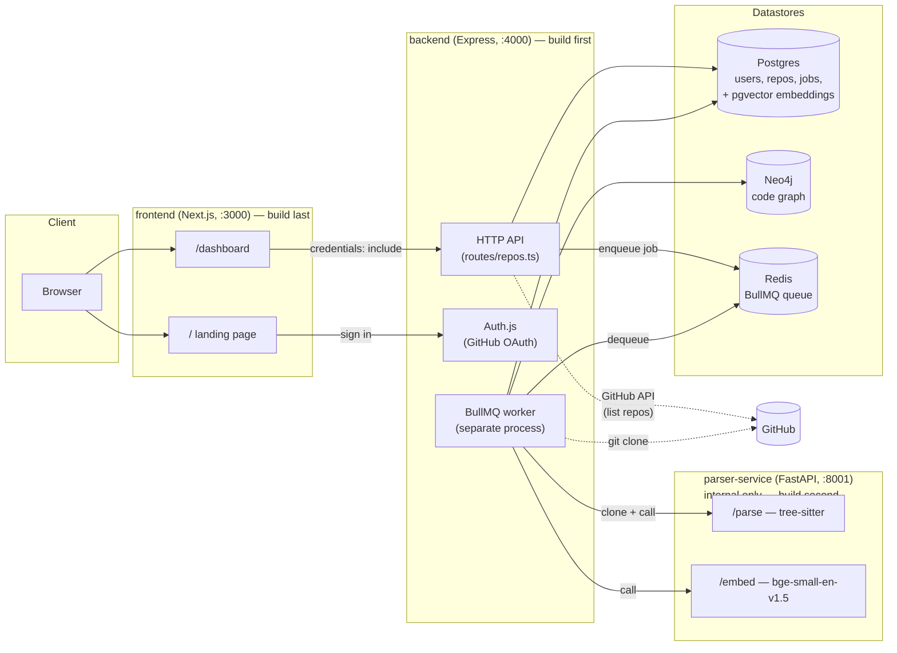
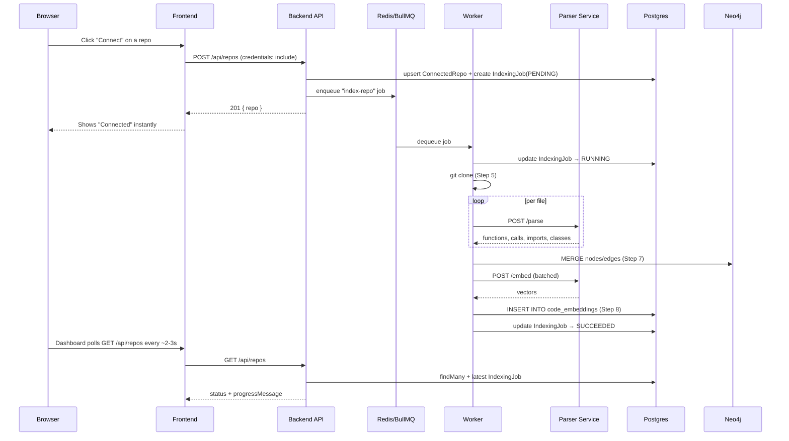
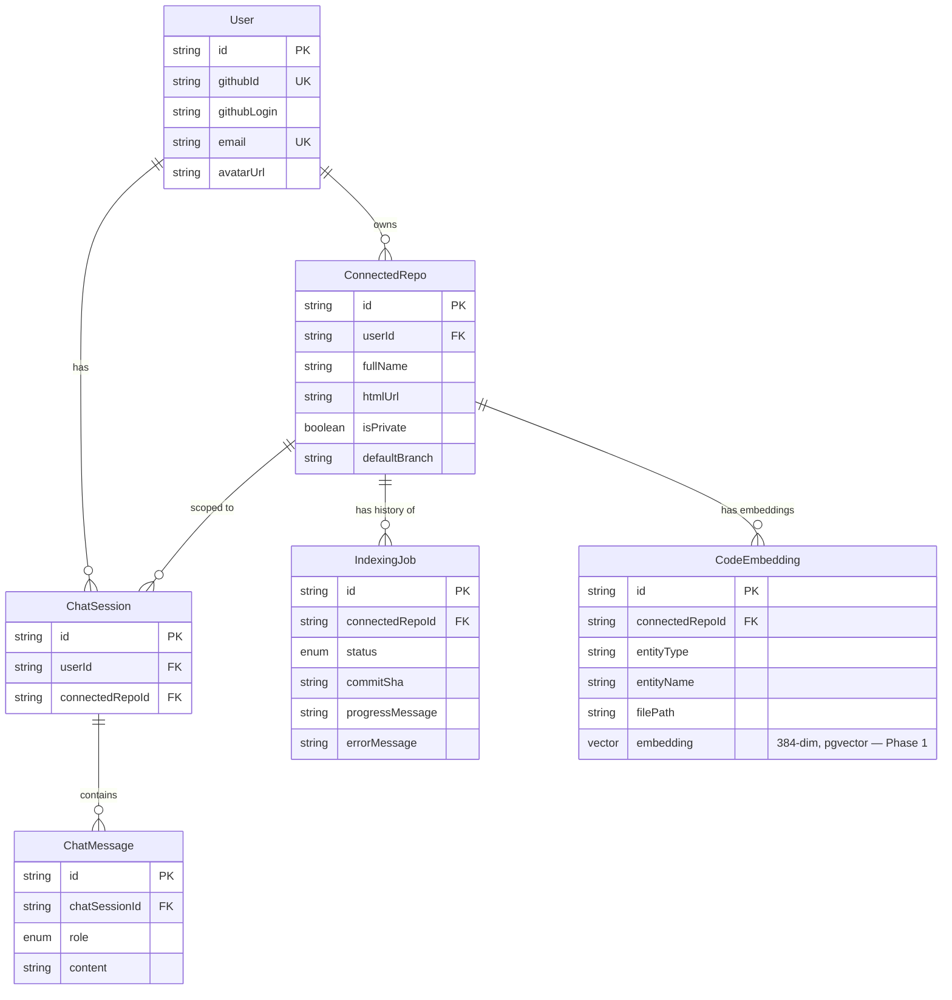
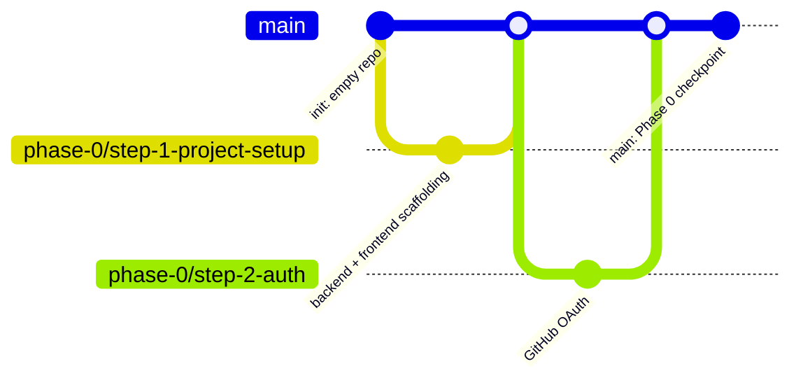

# AGENTS.md

**Current state: nothing is built yet.** This file describes the target architecture and the order things will be built in — not what exists today. Update the Status columns as work actually lands; don't mark something done until it's been built, run, and checked against its RFC's checkpoint.

---

## Project Overview

**CodeCortex** is a multi-agent AI system for understanding codebases through a living knowledge graph. A user connects a GitHub repo; the system clones it, parses it structurally (tree-sitter), builds a dependency graph (Neo4j), embeds it semantically (pgvector), and then answers natural-language questions about it using a team of specialized LLM agents that reason over both the graph and the embeddings — with a dedicated Critic agent verifying every answer against the graph before it's shown to the user.

It is built in five phases, each with a hard checkpoint before the next begins. **Work starts with the backend — the frontend has nothing to render until the backend returns real data.**

| Phase | Name | Status |
|---|---|---|
| 0 | Foundation (auth, data model, repo-connection API) | ✅ Completed |
| 1 | Ingestion Pipeline (clone → parse → graph → embed → orchestrate) | ✅ Completed |
| 2 | Single non-specialized agent (prove question-in/grounded-answer-out) | ⬜ Not started |

| 3 | Full 6-agent system (Planner, Explainer, Bug-Tracer, Reviewer, Refactorer, Critic) | ⬜ Not started |
| 4 | Memory & efficiency (insight cache, incremental re-indexing, evidence display) | ⬜ Not started |
| 5 | Hardening, testing, polish (rate limits, RBAC, logging, automated tests) | ⬜ Not started |

## Project Goals

1. **Correctness over speed.** Answers about code structure must be *verified against the real graph*, not guessed from text similarity. This is the entire reason CodeCortex exists instead of "just use Cursor."
2. **Deterministic before probabilistic.** Phases 0–1 contain zero AI/LLM calls. Structure is established mechanically (parsing, graph writes) before any model reasons about it — so when Phase 2+ gets something wrong, the bug is isolated to the reasoning layer, not tangled up with parsing bugs.
3. **Backend before frontend, always.** The frontend is a thin client over the backend's API. Every phase's backend work must exist and be verified (via `curl`, logs, or a DB check) before any corresponding frontend work starts.
4. **Each phase has a manual checkpoint that is not skippable.** Once Phase 1 is built, Steps 6, 7, and 8 each require hand-verifying output before the next step consumes it. Agents must not treat these checkpoints as optional formality.
5. **Every non-trivial decision is written down before or as it's made.** RFCs go in `docs/rfcs/`, written prospectively (before/during implementation), not retroactively as documentation debt.

## Repository Structure

This is the **target** structure — build it in this order (see Agent Operating Workflow for the build sequence). Nothing below exists yet.

```text
codecortex/
├── AGENTS.md                  ← you are here
├── RULES.md                   Enforceable MUST/MUST NOT rulebook
├── README.md                  Setup, Docker, CI/CD quick reference
├── docker-compose.yml         Local stack: Postgres, Redis, Neo4j, parser-service, both apps
├── .gitignore
├── .prettierrc.json
├── .github/
│   └── workflows/
│       ├── ci.yml              lint + build + test, all services
│       └── docker-publish.yml  builds/pushes images to GHCR after ci.yml passes
│
├── docs/
│   ├── deployment.md
│   └── rfcs/                   One file per architectural decision — see RFC Index
│
├── backend/                   Express + TypeScript — owns ALL server-side state — BUILD FIRST
│   ├── src/
│   │   ├── index.ts             HTTP API entrypoint (Express app)
│   │   ├── lib/
│   │   │   ├── prisma.ts          Prisma client singleton
│   │   │   ├── auth.ts            Auth.js config (GitHub provider)
│   │   │   ├── auth-types.d.ts    Session type augmentation
│   │   │   ├── neo4j.ts           Neo4j driver singleton
│   │   │   └── parser-client.ts   HTTP client for parser-service
│   │   ├── middleware/
│   │   │   └── requireAuth.ts     Session → local User upsert → req.user
│   │   ├── routes/
│   │   │   └── repos.ts           /api/repos/* handlers
│   │   ├── jobs/
│   │   │   ├── queue.ts           BullMQ queue definition
│   │   │   ├── worker.ts          Separate entrypoint — processes indexing jobs
│   │   │   └── pipeline/
│   │   │       ├── fetch-repo.ts          Step 5 — clone + filter
│   │   │       ├── parse-files.ts         Step 6 — calls parser-service
│   │   │       ├── build-graph.ts         Step 7 — writes Neo4j
│   │   │       └── generate-embeddings.ts Step 8 — writes pgvector
│   │   └── __tests__/
│   ├── prisma/
│   │   └── schema.prisma        Postgres schema
│   ├── package.json
│   ├── tsconfig.json
│   ├── Dockerfile
│   └── .env.example
│
├── parser-service/            Python + FastAPI — internal only, never public-facing — BUILD SECOND
│   ├── app/
│   │   ├── main.py               /parse, /embed, /health
│   │   ├── schemas.py            Pydantic request/response contracts
│   │   ├── embeddings.py         bge-small-en-v1.5 via sentence-transformers
│   │   └── parsers/
│   │       └── javascript.py     tree-sitter fact extraction (JS/TS/JSX/TSX)
│   ├── tests/
│   ├── requirements.txt
│   └── Dockerfile
│
└── frontend/                  Next.js 14 (App Router) + TypeScript + Tailwind — BUILD LAST
    ├── app/
    │   ├── page.tsx             Landing page (/, sign in with GitHub)
    │   └── dashboard/page.tsx   Repo connect + status (/dashboard)
    ├── components/
    │   └── RepoConnector.tsx
    ├── lib/
    │   └── api.ts               Typed fetch wrapper around the backend API
    ├── public/
    ├── package.json
    ├── tsconfig.json
    ├── next.config.mjs
    ├── Dockerfile
    └── .env.example
```

## Architecture



## System Boundaries

- **`frontend/`** never talks to Postgres, Neo4j, Redis, or the parser service directly. It only calls `backend/`'s HTTP API. The frontend process must hold zero secrets, by design.
- **`backend/`** (API process) never calls the parser service or writes to Neo4j directly from a request handler — that only happens inside `jobs/worker.ts`, off the request/response path. The API process enqueues; the worker process executes.
- **`parser-service/`** must have no database credentials, no knowledge of `ConnectedRepo`/`User`, and no public ingress in any real deployment. It is a pure function: file/text in, structured facts or vectors out. It must **never** execute code from a repo it's parsing.
- **No component reaches into another component's database.** The parser service must not touch Postgres. The frontend must not touch Neo4j. Every cross-boundary interaction is an explicit HTTP call with a typed contract.

Agents must not blur these boundaries "for convenience" when building. If a boundary feels inconvenient, that's a signal to raise it as an RFC discussion, not to route around it silently.

## Technology Stack

| Layer | Choice | Build order |
|---|---|---|
| Backend framework | Express + TypeScript | 1st |
| Auth | Auth.js (`@auth/express`), GitHub OAuth only, JWT sessions | 1st |
| Primary DB | Postgres (Neon in prod, local container in Docker dev) via Prisma | 1st |
| Repo cloning | `simple-git` (shallow clone) | 2nd |
| Parsing | Python + FastAPI + tree-sitter (`tree-sitter-javascript`, `tree-sitter-typescript`) | 2nd |
| Graph DB | Neo4j (Cypher) | 2nd |
| Vector store | pgvector extension on the same Postgres instance | 2nd |
| Embeddings | `BAAI/bge-small-en-v1.5` via `sentence-transformers`, run locally (no external API) | 2nd |
| Job queue | BullMQ + Redis | 2nd |
| Frontend framework | Next.js 14, App Router, TypeScript, Tailwind | 3rd (last) |
| Containerization | Docker, multi-stage builds, `docker-compose.yml` for local dev | alongside backend |
| CI | GitHub Actions (`ci.yml` lint/build/test, `docker-publish.yml` image builds) | alongside backend |

**Do not introduce a new datastore, queue, or major framework without an RFC.** Every choice above must have its tradeoffs documented in `docs/rfcs/` before or as it's implemented; swapping a piece later (e.g., Redis → SQS, Neo4j → a Postgres-CTE graph) is an architectural decision, not a refactor.

## Data Ownership

| Data | Owned by | Never written to by |
|---|---|---|
| `User`, `ConnectedRepo`, `IndexingJob`, `ChatSession`, `ChatMessage`, `CodeEmbedding` (Postgres) | `backend/` exclusively | `frontend/`, `parser-service/` |
| Code graph (Neo4j) | `backend/src/jobs/` exclusively (only the worker writes; nothing else does) | `frontend/`, `parser-service/`, the API request-handling side of `backend/` |
| GitHub access token | Must live only in the Auth.js JWT session cookie. **Must never be persisted to any database.** | Everything — this must be a deliberate design constraint from the first line of auth code, not an afterthought |
| Job queue state | Redis, owned by BullMQ, mirrored into `IndexingJob.status`/`progressMessage` for anything user-facing | `frontend/` (reads Postgres only, never Redis) |

**Known decision to make early:** because the token is never persisted, the BullMQ worker (which runs with no HTTP session) will have no credential to clone *private* repos. Decide this in RFC 0002 or a dedicated RFC 0010 before Step 5 (repo fetching) is built — either "public repos only for now" (simplest, recommended starting point) or a deliberate encrypted-token-storage design. Don't discover this gap mid-implementation and patch around it.

## Monorepo Rules

- One `package.json` per JS/TS app (`frontend/`, `backend/`) — no shared `node_modules` hoisting, no workspaces tooling (Turborepo/Nx/pnpm workspaces) unless an RFC justifies it later.
- `parser-service/` is Python and manages its own dependencies via `requirements.txt` — never mix Python deps into a JS lockfile or vice versa.
- Cross-app types will not be shared via any package initially — `frontend/lib/api.ts` will hand-declare copies of backend response shapes. Whoever changes a Prisma model or a route's response shape must grep for and update the corresponding frontend type by hand. Document this tradeoff in RFC 0001 when it's written.
- Every app gets its own Dockerfile and its own CI job. Don't collapse them into one shared build step.

## Feature Architecture

New backend features follow this shape, in this order:
1. **Prisma schema change first** (if state is involved) → migration → RFC if the change is non-trivial.
2. **Route/handler** (`backend/src/routes/`) — thin: validate input (Zod), call into `lib/` or `jobs/pipeline/` logic, return a response. No business logic directly in route handlers beyond orchestration.
3. **Frontend consumption comes last** — add the typed function to `frontend/lib/api.ts`, then use it from a component. Components do not call `fetch` directly. Do not start this step until the backend endpoint is built and manually verified (`curl` or Postman) to return correct data.

New pipeline stages (anything that runs inside the BullMQ worker) should follow one consistent pattern from the start: one file per stage under `backend/src/jobs/pipeline/`, a pure-ish function taking explicit typed inputs and returning explicit typed outputs, wired together in `worker.ts`. Stages must be independently testable without running the full pipeline — design them this way from the first stage, not retrofitted later.

## Shared Data Contracts

- **Frontend ↔ Backend:** plain REST + JSON. Request bodies validated server-side with Zod. No tRPC, no GraphQL for the initial build — this should be an explicit RFC 0001 decision, not a default nobody chose.
- **Backend ↔ Parser service:** JSON over HTTP, contract defined by `parser-service/app/schemas.py` (Pydantic) and mirrored by hand in `backend/src/lib/parser-client.ts` (TypeScript types). **These two must be kept in sync manually** — no codegen between them. If you change one, change the other in the same change.
- **Job payloads (BullMQ):** minimal — IDs only (`indexingJobId`, `connectedRepoId`), never secrets, never large payloads. The worker re-fetches whatever it needs from Postgres at job-start.

## API Architecture

Target flow once Phase 0 + Phase 1 are both built:



Route conventions to follow from the first route written:
- All routes under `/api/*` require auth via a `requireAuth` middleware unless explicitly documented otherwise.
- Auth.js's own routes live under `/auth/*`, mounted before `express.json()` (it parses its own body — this ordering matters from the start).
- Every mutating endpoint validates its body with Zod before touching Prisma.

## Database Architecture

Target Postgres schema (Phase 0 + Phase 1 combined — build Phase 0's tables first, add `CodeEmbedding` in Phase 1):



Plus, separately, the **Neo4j graph** (Phase 1, different database entirely):

(:Repo)-[:CONTAINS]->(:File)-[:DEFINES]->(:Function|:Class)
(:Function)-[:CALLS]->(:Function)
(:File)-[:IMPORTS]->(:File)
(:Class)-[:INHERITS]->(:Class)


Every node should carry a `repoId` property for multi-tenant scoping within one shared Neo4j instance — decide and document this in RFC 0007.

Rules to follow from the first migration:
- All foreign keys must specify an explicit `onDelete` behavior — default to `Cascade` unless there's a stated reason not to.
- All Neo4j writes must use `MERGE`, never `CREATE`, for idempotent re-indexing.
- Never write raw SQL string-concatenation — use Prisma's tagged-template `$queryRaw`/`$executeRaw` (needed for the `vector` column, since Prisma doesn't model it natively).
- Never string-concatenate into a Cypher query — always use `$parameters`.

## Authentication & Authorization

- GitHub OAuth must be the **only** login method (Phase 0, first thing built after project scaffolding). Do not add password auth, magic links, or other providers without an RFC.
- Session = JWT cookie, `httpOnly`, set by `@auth/express`. `AUTH_SECRET` must be unique per environment, generated with real entropy (`npx auth secret`), never committed.
- Build a `requireAuth` middleware as the **only** way a route gets `req.user` — it should upsert the local `User` row from the session on every request. Don't let individual routes implement their own parallel session-checking logic.
- **Authorization model from day one: every user only ever sees their own data.** No roles, no teams, no sharing. Don't build any cross-user data access, even accidentally.
- The GitHub access token must never be persisted to any database (see Data Ownership's flagged decision above).

## Environment & Secrets

- Each app gets its own `.env` (`backend/.env`, `frontend/.env.local`) sourced from its own `.env.example`. Never share one `.env` across apps.
- Backend will eventually need: `DATABASE_URL`, `GITHUB_CLIENT_ID/SECRET`, `AUTH_SECRET`, `PORT`, `FRONTEND_ORIGIN` (Phase 0), then `REDIS_URL`, `NEO4J_URI/USER/PASSWORD`, `PARSER_SERVICE_URL` (Phase 1). Frontend needs `NEXT_PUBLIC_BACKEND_URL`.
- `NEXT_PUBLIC_*` vars are baked into the frontend's client bundle at **build time** — treat them as public, never put a secret behind that prefix.
- `.env*` files must be gitignored from the very first commit.
- Docker: secrets flow in via `env_file:`/`environment:` in `docker-compose.yml`, or via the deploy platform's secret manager in production — never baked into an image layer, except `NEXT_PUBLIC_BACKEND_URL` which is a documented, deliberate exception because Next.js requires it at build time.

## Security Guidelines

- **Never execute code from a cloned/parsed repo.** tree-sitter must be a pure parser — this constraint must be true from the first line of `parser-service/` code, never relaxed for an edge case.
- **CORS must be locked to an explicit `FRONTEND_ORIGIN`**, never `*`, from the first `cors()` call — this is paired with `credentials: true`, and permissive CORS + credentials is a session-hijack vector.
- **All Cypher and raw SQL must be parameterized**, from the first query written. No string interpolation of user- or repo-derived data into a query string, ever.
- **The parser service must have no auth of its own and no public ingress** in any deployment, by design from the start.
- Validate all external input (request bodies, pasted URLs) server-side with Zod, even where the frontend already validates.
- Before adding any external API call that sends repo content to a third party, check: does this leak private code to a service outside our control? The embedding model should run locally specifically to avoid this — don't casually swap it for a hosted API without review.

## Coding Principles

- **TypeScript strict mode must be on** in both `frontend/tsconfig.json` and `backend/tsconfig.json` from project scaffolding. Don't add `// @ts-ignore` to work around a type error.
- **Deterministic steps stay deterministic.** Nothing in Phase 1 (Steps 5–9) may call an LLM. Keep AI reasoning strictly downstream of the graph/embeddings, never inside the parsing/graph-writing code paths, when Phase 2+ eventually gets built.
- **Pipeline stages must be pure-ish and independently testable** from the first stage written — explicit inputs, explicit outputs, no hidden shared mutable state.
- **Fail loud, not silent, for correctness-affecting gaps.** A known limitation (like the private-repo credential gap) should surface as a clear `FAILED` status with an explanatory message, not a silent skip or a workaround that compromises a security decision.
- **One bad input shouldn't fail an entire batch job where avoidable** — a single bad file during parsing should log and continue, not abort the whole index run. A bad *job-level* precondition (e.g., private repo, no credential) should fail the whole job clearly.
- Prefer explicit, readable code over clever abstraction, especially in the ingestion pipeline.

## Naming Conventions

- **Files:** `kebab-case.ts` for backend modules, `PascalCase.tsx` for React components, `snake_case.py` for Python modules.
- **Prisma models:** `PascalCase` singular, mapped to `snake_case` plural table names via `@@map`.
- **Neo4j labels:** `PascalCase` singular (`:File`, `:Function`, `:Class`, `:Repo`).
- **Neo4j relationship types:** `SCREAMING_SNAKE_CASE` verbs (`:CALLS`, `:IMPORTS`, `:DEFINES`, `:CONTAINS`, `:INHERITS`).
- **Env vars:** `SCREAMING_SNAKE_CASE`, prefixed `NEXT_PUBLIC_` only when genuinely meant for the client bundle.
- **RFC files:** `docs/rfcs/NNNN-kebab-case-title.md`, sequential numbering, never reused.

## Git Workflow



- Branch per step (or a tightly related group of steps), named `phase-N/step-M-short-description`, matching the report's own step numbering.
- `main` should always be in a state that passes `ci.yml` — set up `ci.yml` in Step 1, before there's much to break.
- Commit messages should reference the step/RFC where relevant (e.g. `feat(backend): Step 2 GitHub OAuth (RFC 0002)`), so `git log` doubles as a phase-progress trail from commit one.

## Testing Strategy

### Current state, honestly

Nothing is built, so nothing is tested. This section describes what to set up **as each piece is built**, not retroactively.

| Component | When to add first test |
|---|---|
| `backend/` | A smoke test in `src/__tests__/` the moment `npm test` is wired into `package.json` (Step 1) |
| `parser-service/` | Fixture-based pytest tests the moment `extract_facts()` exists (Step 6) — this is the highest-value test in the whole project, don't defer it |
| Pipeline (Steps 5–9 end-to-end) | Manual hand-verification is *mandatory* at each of Steps 6, 7, 8 before moving to the next — don't skip these even though they're not automated |
| `frontend/` | Type-checking via `next build` in CI is sufficient at first; component tests can wait |

### Rules for new pipeline code

- Every pipeline stage must be callable in isolation, with explicit typed inputs/outputs, from the moment it's written — this is what makes fixture-based testing possible at all.
- A stage's manual checkpoint must actually be performed and its result stated before the stage is considered done — "it compiles" is not evidence of correctness for Steps 6/7/8.
- Add `pytest` to `parser-service/requirements.txt` in the same commit that creates `parsers/javascript.py` — don't build the parser first and add tests "later."

## CI/CD

- `.github/workflows/ci.yml` should exist by the end of Step 1 — lint + build + test for `backend/`, added to for `frontend/` and `parser-service/` as each is scaffolded.
- `.github/workflows/docker-publish.yml` — builds and pushes images to GHCR after `ci.yml` passes on `main`. Set this up once Dockerfiles exist for each service.
- `deploy` job should start as a documented placeholder (`if: false`) until a real deploy target is chosen — see `docs/deployment.md`.
- Every service gets: its own CI job, its own Dockerfile, its own `docker-compose.yml` entry, in the same change that introduces it — not as a follow-up.

## Documentation

- **RFCs (`docs/rfcs/`) are the primary design record.** Any decision with real alternatives (a library choice, a schema shape, a security tradeoff) gets one, written before or during implementation — see the RFC Index below for the full planned list.
- **This file (`AGENTS.md`) is the operating manual** — keep it current with *how things actually work* as they get built, and point to RFCs for *why*.
- **`RULES.md`** is the enforceable rulebook (strict MUST/MUST NOT).
- **`README.md`** is the human quick-start — write it alongside Step 1, keep it in sync as setup steps are added.
- Inline code comments should explain *why*, not restate *what* the code already makes obvious.

## Change Management

- A change that touches an existing RFC's decision requires updating or superseding that RFC as part of the same change.
- A change that adds a new cross-service contract must update both sides' type definitions in the same change.
- Schema changes should be additive where possible; a breaking change needs an explicit migration plan called out in the PR description.
- Known gaps/limitations found while implementing get documented inline **and** as an Open Question in the relevant RFC — don't fix them with a quiet workaround that undermines a security decision.

## Definition of Done

A change is done when:
- [ ] It compiles/typechecks clean.
- [ ] Lint passes for any code touched.
- [ ] Tests exist and pass per the Testing Strategy for that component.
- [ ] Any new/changed cross-service contract is updated on **both** sides.
- [ ] Secrets aren't hardcoded; new env vars are added to the relevant `.env.example`.
- [ ] A decision with real alternatives has an RFC.
- [ ] `docker-compose.yml` still starts the affected service(s) cleanly if their config changed.
- [ ] The relevant phase/step's mandated manual checkpoint has actually been performed, with its result stated — not assumed.

## Agent Operating Workflow

**Build order — this is the actual sequence to follow from an empty repo:**

1. **`git init`, create `README.md`, `.gitignore`, `AGENTS.md`, `RULES.md`.**
2. **Backend scaffolding** (Phase 0, Step 1): `backend/package.json`, `tsconfig.json`, Express app skeleton, `ci.yml`'s backend job. Get `npm run dev` returning something on `/health` before anything else.
3. **Backend auth** (Step 2): Prisma installed, GitHub OAuth via Auth.js, `requireAuth` middleware. RFC 0002 written alongside this.
4. **Backend data model** (Step 3): full Prisma schema, first migration. RFC 0003 written alongside this.
5. **Backend repo-connection routes** (Step 4): `POST/GET /api/repos`. RFC 0004 written alongside this. **Verify with `curl` before writing any frontend code.**
6. **Only now, frontend scaffolding**: landing page, GitHub sign-in button, dashboard page consuming the backend routes already built and verified in step 5.
7. **Docker + CI/CD**: Dockerfiles, `docker-compose.yml`, `docker-publish.yml` — do this once Phase 0 works, before starting Phase 1's added complexity.
8. **Phase 1, backend-only, in order**: repo fetching (RFC 0005) → parser service (RFC 0006, with tests from the start) → graph writer (RFC 0007) → embeddings (RFC 0008) → BullMQ orchestration (RFC 0009) wiring it all together. No frontend changes needed until Step 9's dashboard polling update.
9. Each subsequent phase follows the same pattern: backend fully built and manually checkpointed → RFC written → only then any frontend consumption.

Within any single step:
1. **Identify the phase/step** the task belongs to.
2. **Write the RFC first** (status: Proposed) if the step involves a real decision — don't decide silently while coding.
3. **Locate the correct boundary** per System Boundaries — don't add logic to the wrong layer for convenience.
4. **Implement**, following the pattern established by whichever sibling file/stage was built most recently.
5. **Update both sides of any cross-service contract** in the same change.
6. **Add tests** per Testing Strategy.
7. **Update docs.**
8. **Self-check against Definition of Done.**
9. **Report gaps honestly** — if something doesn't fully work, say so explicitly.

## General Agent Rules

- **Never fabricate output you haven't actually produced or verified.** If a command wasn't run, a test wasn't executed, or a service wasn't started, don't describe it as if it was.
- **Don't silently expand scope.** Surface a needed change in an earlier piece explicitly rather than quietly refactoring without calling it out.
- **Don't weaken a security decision** (token non-persistence, CORS lock-down, parameterized queries, no-eval parsing) to make a task easier — raise it as a tradeoff for a human to decide, with an RFC.
- **Prefer the smallest correct change** that satisfies the task.
- **When uncertain between two reasonable approaches, pick one, state the assumption, and proceed** — don't block on a question answerable by a sensible default.
- **Backend before frontend, every time**, unless the task is explicitly, only about UI/UX with no real data involved.

## Scope Boundaries

Agents working in this repo should **not**, without explicit instruction:
- Introduce a new datastore, queue technology, or core framework.
- Add authentication providers beyond GitHub OAuth.
- Persist the GitHub access token anywhere durable.
- Give the parser service public network ingress.
- Start implementing Phase 2/3 (agents, LLM calls, chat) before Phase 1 exists and its checkpoint is confirmed.
- Start implementing Phase 1 before Phase 0 exists and its checkpoint is confirmed.
- Build frontend UI for an endpoint that doesn't exist and hasn't been manually verified in the backend yet.
- Add advertising, telemetry, or third-party analytics without it being an explicit, separate task.

## Project-Specific Agent Instructions

- **This project follows the CodeCortex-Complete-Report.md phase plan exactly.** Don't reorder steps within a phase, and don't start a later phase's steps early, even if it seems efficient.
- **Every pipeline stage must be independently runnable/testable against a fixture** from the moment it's written.
- **When Phase 2/3 eventually get built:** the Critic agent's verification-against-the-graph is CodeCortex's core differentiator. It must not be cut for a faster first version.
- **Match an RFC-first culture from commit one.** Writing the RFC before or during implementation, not after, is the whole point.

## RFC Index

All RFCs will live in `docs/rfcs/`, numbered sequentially, never reused. This is the **complete planned backend RFC list** — write each one as its corresponding feature is built, not before, and not skipped after.

### Phase 0 — Foundation

| # | Title | Covers |
|---|---|---|
| 0001 | Service topology | Separate Express backend vs. Next.js API routes — decide before writing any backend code |
| 0002 | Authentication | Auth.js + GitHub OAuth, JWT sessions, token non-persistence decision |
| 0003 | Phase 0 data model | Prisma schema — `User`, `ConnectedRepo`, `IndexingJob`, `ChatSession`, `ChatMessage` |
| 0004 | Repo-connection flow | `POST/GET /api/repos`, GitHub API proxying, idempotency |

### Phase 1 — Ingestion Pipeline

| # | Title | Covers |
|---|---|---|
| 0005 | Repo fetching strategy | Shallow clone vs. Contents API, file filtering, temp workspace cleanup |
| 0006 | Parsing microservice | Python + FastAPI + tree-sitter, why a separate service, API contract |
| 0007 | Graph database & schema | Neo4j node/edge design, multi-tenancy via `repoId`, MERGE-based idempotent writes |
| 0008 | Embedding generation | bge-small-en-v1.5, pgvector storage, why not a dedicated vector DB |
| 0009 | Job orchestration | BullMQ + Redis, status transitions, worker process separation |
| 0010 | Private-repo credential decision | **Write this before Step 5 if private repos matter at all** — otherwise explicitly scope Phase 1 to public repos only and revisit later |

### Phase 2 — Single Agent

| # | Title | Covers |
|---|---|---|
| 0011 | Hybrid retrieval | Merging pgvector semantic search with Neo4j graph traversal into one context bundle |
| 0012 | Single-agent LLM integration | First LLM call, chat session/message persistence endpoints |

### Phase 3 — Multi-Agent System

| # | Title | Covers |
|---|---|---|
| 0013 | Planner agent | Question classification and routing |
| 0014 | Specialist agents + tool-calling | Explainer/Bug-Tracer/Reviewer/Refactorer, tool definitions (`get_callers()`, `search_semantic()`, etc.) |
| 0015 | Critic agent | Graph-verification of draft answers — CodeCortex's core differentiator, do not cut |
| 0016 | Agent step streaming | SSE streaming of Planner/specialist/Critic progress, not just final answer |

### Phase 4 — Memory & Efficiency

| # | Title | Covers |
|---|---|---|
| 0017 | Insight cache | Store verified Q&A pairs per repo, check before re-investigating |
| 0018 | Incremental re-indexing | Diff against last indexed commit, update only changed files |
| 0019 | Evidence data in API responses | Backend exposes graph path/snippet behind an answer, not just prose |

### Phase 5 — Hardening

| # | Title | Covers |
|---|---|---|
| 0020 | Rate limiting / cost controls | Cap agent iterations and LLM calls per user/window |
| 0021 | RBAC / private repo access | Resolves RFC 0010's deferred decision properly, tied to GitHub's permission model |
| 0022 | Structured logging / agent trace | Per-agent-step logging, doubling as an in-app debug view |
| 0023 | Automated pipeline/agent tests | Fixture-based, deterministic, no live LLM calls in CI |

**Rule:** don't write RFC 0011 while RFC 0005–0009 are still unbuilt. Don't write RFC 0006 before RFC 0005 is actually implemented and checkpointed. The numbering above is the plan, not permission to jump ahead.