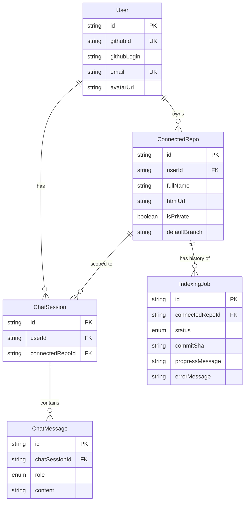

# RFC 0003: Phase 0 Data Model (Prisma / Postgres)

| Metadata | Details |
|---|---|
| **Status** | Proposed |
| **Phase** | 0 (Step 3) |
| **Date** | 2026-08 |
| **Author** | CodeCortex team |
| **Affects** | `backend/prisma/schema.prisma` |
| **Depends on** | [RFC 0001](file:///e:/Projects/CodeCortex/docs/rfcs/0001-service-topology.md), [RFC 0002](file:///e:/Projects/CodeCortex/docs/rfcs/0002-authentication.md) |

---

## Summary

> [!IMPORTANT]
> The initial Postgres database schema defines five core relational tables via Prisma: `User`, `ConnectedRepo`, `IndexingJob`, `ChatSession`, and `ChatMessage`. Code structure graph data (Neo4j) and vector embeddings (`pgvector`) are intentionally handled separately in Phase 1.

---

## Detailed Design

### Entity Relationship Diagram



---

## Table Rationale

### 1. `User`
- Keyed on unique `githubId` matching GitHub identity.
- No password hashes or auth credentials stored.

### 2. `ConnectedRepo`
- Enforces composite uniqueness: `@@unique([userId, fullName])`.
- Allows multiple users to independently connect the same public repository with strict per-user data isolation.

### 3. `IndexingJob`
- Maintained as an append-only history of indexing runs per repository (`PENDING`, `RUNNING`, `SUCCEEDED`, `FAILED`).
- Contains placeholder fields (`commitSha`, `progressMessage`, `errorMessage`) to allow seamless worker integration in Phase 1 without schema migration.

### 4. `ChatSession` & `ChatMessage`
- Pre-created in Phase 0 schema to avoid riskier schema migrations on populated tables when Phase 2 starts.
- All foreign keys enforce `onDelete: Cascade`.

---

## Schema Enums

```prisma
enum IndexingStatus {
  PENDING
  RUNNING
  SUCCEEDED
  FAILED
}

enum ChatRole {
  USER
  ASSISTANT
  SYSTEM
}
```

---

## Implementation Plan

1. Install Prisma and setup Postgres connection in `backend/prisma/schema.prisma`.
2. Generate initial migration: `npx prisma migrate dev --name init`.
3. Verify schema structure via `npx prisma studio`.
