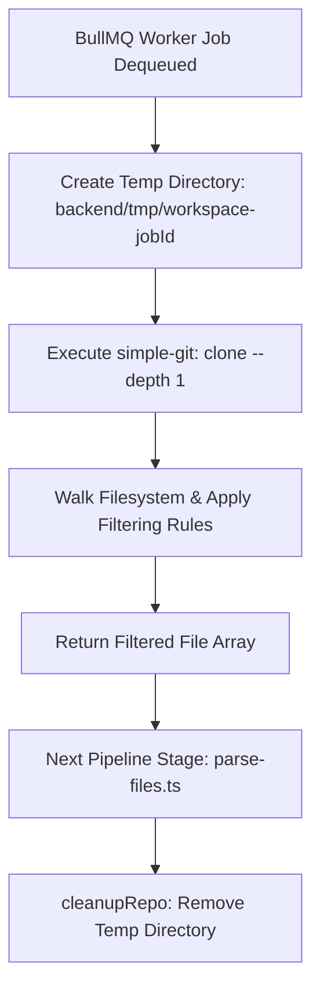

# RFC 0005: Repo Fetching Strategy — Shallow Git Clone vs. GitHub Contents API

| Metadata | Details |
|---|---|
| **Status** | Proposed |
| **Phase** | 1 (Step 5) |
| **Date** | 2026-09 |
| **Author** | CodeCortex team |
| **Affects** | `backend/src/jobs/pipeline/fetch-repo.ts`, `backend/src/jobs/worker.ts` |
| **Depends on** | [RFC 0001](file:///e:/Projects/CodeCortex/docs/rfcs/0001-service-topology.md), [RFC 0004](file:///e:/Projects/CodeCortex/docs/rfcs/0004-repo-connection-flow.md) |

---

## Summary

> [!IMPORTANT]
> The repository fetching stage is the first step of the Phase 1 ingestion pipeline. CodeCortex will fetch target codebases using **shallow git cloning (`git clone --depth 1`)** via `simple-git` into isolated temporary workspace directories (`backend/tmp/workspace-${jobId}`), applying strict file-size and binary/non-code path filters before passing files to the parsing stage.

---

## Terminology

- **Shallow Clone:** A git clone operation with `--depth 1` that retrieves only the latest commit snapshot without historical commit logs or tags.
- **Workspace Sandbox:** A per-job temporary directory created under `backend/tmp/` to hold checked-out repo files during the indexing run.
- **Filter-Out Rules:** Rules that exclude binary assets (`.png`, `.pdf`), heavy dependencies (`node_modules/`, `vendor/`), built outputs (`dist/`, `.next/`), and VCS metadata (`.git/`) from AST parsing and embedding.

---

## Motivation

### The problem this RFC solves
To build a code dependency graph (Neo4j) and semantic vector store (pgvector), CodeCortex needs access to complete source trees. Fetching files individually over the GitHub REST API (Contents API) introduces strict rate-limit constraints, high network latency (N HTTP roundtrips for N files), and complex recursive tree traversal overhead.

### Why this can't be deferred
Establishing repository fetching patterns upfront defines the input contract for tree-sitter AST parsing ([RFC 0006](file:///e:/Projects/CodeCortex/docs/rfcs/0006-parsing-microservice.md)). Deciding file filtering rules early prevents wasting compute, storage, and embedding model tokens on binary assets or auto-generated lockfiles.

---

## Detailed Design

### Shallow Git Clone vs. GitHub REST Contents API



1. **`simple-git` Integration:** The worker executes shallow cloning against the public HTTPS repository URL (`htmlUrl`).
2. **Speed & Efficiency:** `--depth 1` minimizes network payload size and disk footprint, fetching only the current tree state.

### File Filtering Rules

To protect tree-sitter parsers and storage indices, `fetch-repo.ts` enforces strict filtering constraints:

| Category | Filter Rule / Exclusion |
|---|---|
| **Max File Size** | `MAX_FILE_SIZE_BYTES = 524_288` (500 KB limit per file). |
| **VCS & Dependencies** | `.git/`, `node_modules/`, `vendor/`, `.venv/`, `__pycache__/` |
| **Build Artifacts** | `dist/`, `build/`, `out/`, `.next/`, `target/` |
| **Binary & Media Formats** | `.png`, `.jpg`, `.jpeg`, `.gif`, `.ico`, `.pdf`, `.zip`, `.gz`, `.exe`, `.dll`, `.so`, `.wasm` |
| **Lockfiles & Data** | `package-lock.json`, `yarn.lock`, `pnpm-lock.yaml`, `Cargo.lock`, `.min.js`, `.min.css` |

### Temporary Workspace Directory Isolation

Workspaces are strictly isolated per job execution:
- Directory path: `backend/tmp/workspace-${indexingJobId}`
- **Resource Cleanup Guarantee:** The worker executes cloning and reading within a `try ... finally` block. `cleanupRepo()` is guaranteed to run even if parsing or downstream stages fail, preventing disk leakages.

```typescript
// Pipeline contract pattern in backend/src/jobs/pipeline/fetch-repo.ts
export interface FetchRepoParams {
  indexingJobId: string;
  repoUrl: string;
  defaultBranch: string;
}

export interface FetchedFile {
  relativePath: string;
  absolutePath: string;
  extension: string;
  sizeBytes: number;
}

export interface FetchRepoResult {
  workspacePath: string;
  commitSha: string;
  files: FetchedFile[];
}
```

---

## Implementation Plan

1. Install `simple-git` in `backend/package.json`.
2. Implement `backend/src/jobs/pipeline/fetch-repo.ts`.
3. Create helper function `cleanupRepo(workspacePath: string)` using `fs.rm(..., { recursive: true, force: true })`.
4. Implement filesystem walker applying size and extension filters.
5. Unit test `fetch-repo.ts` with a mock repository fixture.

---

## Alternatives Considered

| Option | Pros | Cons | Verdict |
|---|---|---|---|
| **GitHub Contents REST API** | No disk usage or `git` binary required | Vulnerable to API rate limits, slow N-request latency | **Rejected** |
| **Tarball Download API (`/tarball`)** | Single HTTP download without `git` | Requires extracting in memory/disk, lacks sha resolution | **Rejected** |
| **Shallow `git clone --depth 1`** | Fast, complete tree access, standard `git` tooling | Requires disk space during execution | **Proposed** |

---

## Security Considerations

> [!CAUTION]
> - Repository file contents are untrusted. Cloning MUST NEVER trigger repository-defined hooks or post-install scripts.
> - Workspace paths MUST be sanitized to prevent directory traversal outside `backend/tmp/`.
> - Temporary directories MUST be deleted in the `finally` block to prevent secret leakages or disk exhaustion.

---

## Success Criteria

- `fetch-repo.ts` clones a public repository in under 5 seconds for average repos.
- Files exceeding 500 KB and `node_modules`/`.git` files are omitted from the output array.
- Workspace directory is deleted cleanly on completion or failure.
