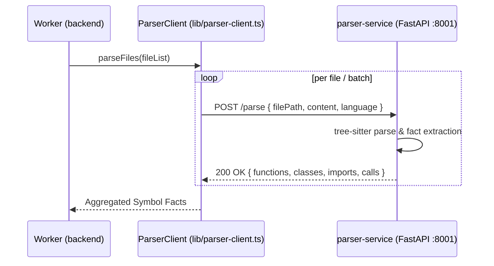

# RFC 0006: Parsing Microservice — Python + FastAPI + tree-sitter

| Metadata | Details |
|---|---|
| **Status** | Proposed |
| **Phase** | 1 (Step 6) |
| **Date** | 2026-09 |
| **Author** | CodeCortex team |
| **Affects** | `parser-service/`, `backend/src/lib/parser-client.ts`, `backend/src/jobs/pipeline/parse-files.ts` |
| **Depends on** | [RFC 0001](file:///e:/Projects/CodeCortex/docs/rfcs/0001-service-topology.md), [RFC 0005](file:///e:/Projects/CodeCortex/docs/rfcs/0005-repo-fetching-strategy.md) |

---

## Summary

> [!IMPORTANT]
> CodeCortex will perform AST structural parsing using a dedicated **Python + FastAPI microservice (`parser-service/`)** leveraging `tree-sitter`. The service acts as a pure static analyzer: file text in, structured symbol facts (functions, classes, imports, call graphs) out. It holds zero database credentials, runs locally without public network ingress, and never executes untrusted repository code.

---

## Terminology

- **AST (Abstract Syntax Tree):** A structural tree representation of source code syntactic structure produced by a parser.
- **Tree-sitter:** An incremental, language-agnostic parsing framework that generates efficient concrete syntax trees.
- **Symbol Facts:** Extracted structural metadata including function definitions, class declarations, import statements, and invocation call sites.
- **Pure Function Service:** A service that maintains no state, database connections, or side effects beyond processing input HTTP payloads.

---

## Motivation

### The problem this RFC solves
Building a code graph (Neo4j) requires extracting exact code relationships: which function calls which other function, which file imports which module, and which class inherits from another. Regular expressions and naive text splitting cannot handle language grammar subtleties, nested functions, or complex imports.

### Why this can't be deferred
`tree-sitter` Python bindings are robust, mature, and easy to maintain. Isolating parsing into a separate FastAPI service keeps native C-binding compilation out of Node.js `backend/` dependencies, preserving backend stability and clean architecture separation ([RFC 0001](file:///e:/Projects/CodeCortex/docs/rfcs/0001-service-topology.md)).

---

## Detailed Design

### Service Topology & Interaction Contract



### OpenAPI / Pydantic Contract (`parser-service/app/schemas.py`)

```python
from pydantic import BaseModel, Field

class ParseRequest(BaseModel):
    file_path: str = Field(..., description="Relative file path within repository")
    content: str = Field(..., description="Source code text content")
    language: str = Field(..., description="Language identifier (javascript, typescript, python)")

class FunctionFact(BaseModel):
    name: str
    start_line: int
    end_line: int
    params: list[str]
    return_type: str | None = None

class ClassFact(BaseModel):
    name: str
    start_line: int
    end_line: int
    heritage: list[str] = []

class ImportFact(BaseModel):
    source_path: str
    imported_symbols: list[str] = []

class CallFact(BaseModel):
    caller_name: str
    callee_name: str
    line_number: int

class ParseResponse(BaseModel):
    file_path: str
    language: str
    functions: list[FunctionFact] = []
    classes: list[ClassFact] = []
    imports: list[ImportFact] = []
    calls: list[CallFact] = []
    error: str | None = None
```

### TypeScript Client Contract (`backend/src/lib/parser-client.ts`)

`backend/src/lib/parser-client.ts` mirrors the Pydantic response shape by hand to maintain strict static typing across service boundaries:

```typescript
export interface ParseFilePayload {
  filePath: string;
  content: string;
  language: string;
}

export interface ExtractedFacts {
  filePath: string;
  functions: Array<{ name: string; startLine: number; endLine: number; params: string[] }>;
  classes: Array<{ name: string; startLine: number; endLine: number; heritage: string[] }>;
  imports: Array<{ sourcePath: string; importedSymbols: string[] }>;
  calls: Array<{ callerName: string; calleeName: string; lineNumber: number }>;
  error?: string;
}
```

### Error Isolation Strategy

> [!NOTE]
> A single unparseable or syntax-invalid file MUST NOT crash the indexing job.

If `tree-sitter` encounters syntax errors or fails on an individual file, `parser-service/` returns a `200 OK` response with `error: "Failed to parse syntax"` and empty fact arrays. `parse-files.ts` logs a warning and proceeds with remaining files.

---

## Implementation Plan

1. Scaffold `parser-service/` with `requirements.txt` (`fastapi`, `uvicorn`, `tree-sitter`, `tree-sitter-javascript`, `tree-sitter-typescript`, `pytest`).
2. Implement `app/main.py`, `app/schemas.py`, and `app/parsers/javascript.py`.
3. Implement `backend/src/lib/parser-client.ts` HTTP wrapper using `axios` or native `fetch`.
4. Add fixture-based `pytest` unit tests in `parser-service/tests/test_js_parser.py`.
5. Implement `backend/src/jobs/pipeline/parse-files.ts`.

---

## Alternatives Considered

| Option | Pros | Cons | Verdict |
|---|---|---|---|
| **Node.js `web-tree-sitter` WASM** | Stays in Node.js process | WASM memory limits, slow setup, async binding churn | **Rejected** |
| **Regex / Regex-based AST approximations** | Zero dependencies | Fragile, fails on syntax variations and multi-line calls | **Rejected** |
| **Python FastAPI + Native `tree-sitter`** | Clean separation, reliable AST bindings, high performance | Requires separate Python process | **Proposed** |

---

## Security Considerations

> [!CAUTION]
> - `parser-service/` MUST NOT call `exec()`, `eval()`, or import dynamic code from parsed repos under any circumstance.
> - `parser-service/` MUST NOT be assigned database credentials (`DATABASE_URL`, `NEO4J_URI`) or public ingress ports in production configurations.

---

## Success Criteria

- `parser-service/` boots on port 8001 and responds to `GET /health` with `{ "status": "ok" }`.
- `POST /parse` correctly extracts functions, classes, imports, and calls from JS/TS fixtures.
- Pytest suite in `parser-service/tests/` passes cleanly.
