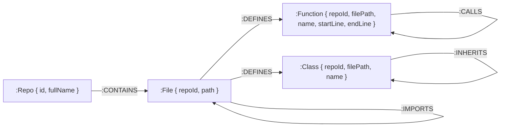

# RFC 0007: Graph Database & Schema — Neo4j Code Structure Graph

| Metadata | Details |
|---|---|
| **Status** | Proposed |
| **Phase** | 1 (Step 7) |
| **Date** | 2026-09 |
| **Author** | CodeCortex team |
| **Affects** | `backend/src/lib/neo4j.ts`, `backend/src/jobs/pipeline/build-graph.ts`, `backend/src/jobs/worker.ts` |
| **Depends on** | [RFC 0001](file:///e:/Projects/CodeCortex/docs/rfcs/0001-service-topology.md), [RFC 0006](file:///e:/Projects/CodeCortex/docs/rfcs/0006-parsing-microservice.md) |

---

## Summary

> [!IMPORTANT]
> CodeCortex models codebase structure inside **Neo4j** using explicit node labels (`:Repo`, `:File`, `:Function`, `:Class`) and directed relationships (`:CONTAINS`, `:DEFINES`, `:CALLS`, `:IMPORTS`, `:INHERITS`). All Neo4j writes are performed exclusively by the background worker (`backend/src/jobs/worker.ts`) using parameterized Cypher `MERGE` queries scoped by `repoId` to enforce idempotency and strict tenant isolation.

---

## Terminology

- **Property Graph Model:** A graph model composed of nodes (entities) and directed relationships (edges), both of which can carry key-value properties.
- **`MERGE` Query:** A Cypher clause that searches for an existing node/relationship pattern and creates it only if it does not already exist, ensuring idempotent writes.
- **Tenant Scope (`repoId`):** A top-level property attached to every graph node enabling multi-tenant data co-existence within a shared Neo4j instance.
- **Single-Writer Rule:** Architectural rule dictating that only the worker process writes to Neo4j; API route handlers only issue read-only Cypher queries.

---

## Motivation

### The problem this RFC solves
Understanding complex software architecture requires querying recursive relationships—such as "which API routes call functions that touch file X" or "what is the call depth of function Y." Relational databases require expensive recursive CTE joins for deep graph traversal, whereas Neo4j traverses relationships in constant time ($O(1)$ pointer hops).

### Why this can't be deferred
Defining the graph schema and node property conventions before building `build-graph.ts` ensures consistent indexing, enables deterministic graph verification by downstream agents ([RFC 0015](file:///e:/Projects/CodeCortex/docs/rfcs/0015-critic-agent.md)), and prevents node duplication bugs.

---

## Detailed Design

### Graph Data Model Schema



### Node Label Specifications

| Node Label | Key Properties | Uniqueness Constraint Pattern |
|---|---|---|
| `:Repo` | `id`, `fullName` | `(r:Repo { id: $repoId })` |
| `:File` | `repoId`, `path` | `(f:File { repoId: $repoId, path: $path })` |
| `:Function` | `repoId`, `filePath`, `name`, `startLine` | `(fn:Function { repoId: $repoId, filePath: $filePath, name: $name, startLine: $startLine })` |
| `:Class` | `repoId`, `filePath`, `name` | `(c:Class { repoId: $repoId, filePath: $filePath, name: $name })` |

### Idempotent Cypher Writer Patterns (`backend/src/jobs/pipeline/build-graph.ts`)

All graph mutations MUST use parameterized Cypher `MERGE` queries to prevent duplicate nodes on re-indexing runs:

```cypher
// 1. Create or Match Repo & File nodes
MERGE (r:Repo { id: $repoId })
ON CREATE SET r.fullName = $fullName

MERGE (f:File { repoId: $repoId, path: $filePath })
MERGE (r)-[:CONTAINS]->(f)

// 2. Define Function nodes & relationships
MERGE (fn:Function {
  repoId: $repoId,
  filePath: $filePath,
  name: $funcName,
  startLine: $startLine
})
ON CREATE SET fn.endLine = $endLine, fn.params = $params
MERGE (f)-[:DEFINES]->(fn)

// 3. Connect Function Calls
MATCH (caller:Function { repoId: $repoId, filePath: $filePath, name: $callerName })
MATCH (callee:Function { repoId: $repoId, name: $calleeName })
MERGE (caller)-[:CALLS]->(callee)
```

> [!CAUTION]
> Cypher query parameters (`$parameters`) MUST be passed as separate argument objects. String concatenation into Cypher query strings is strictly prohibited to prevent Cypher injection vulnerabilities.

### Required Graph Indexes & Constraints (`ensureGraphIndexes`)

```typescript
// backend/src/lib/neo4j.ts initialization routine
export async function ensureGraphIndexes(driver: Driver): Promise<void> {
  const session = driver.session();
  try {
    await session.run(`CREATE CONSTRAINT repo_id_unique IF NOT EXISTS FOR (r:Repo) REQUIRE r.id IS UNIQUE`);
    await session.run(`CREATE INDEX file_repo_path IF NOT EXISTS FOR (f:File) ON (f.repoId, f.path)`);
    await session.run(`CREATE INDEX fn_repo_name IF NOT EXISTS FOR (fn:Function) ON (fn.repoId, fn.name)`);
    await session.run(`CREATE INDEX class_repo_name IF NOT EXISTS FOR (c:Class) ON (c.repoId, c.name)`);
  } finally {
    await session.close();
  }
}
```

---

## Implementation Plan

1. Install `neo4j-driver` in `backend/package.json`.
2. Implement `backend/src/lib/neo4j.ts` exporting driver singleton and `ensureGraphIndexes()`.
3. Add `NEO4J_URI`, `NEO4J_USER`, and `NEO4J_PASSWORD` to `backend/.env.example`.
4. Implement pipeline writer stage `backend/src/jobs/pipeline/build-graph.ts`.
5. Verify graph writes manually using Neo4j Browser (`http://localhost:7474`).

---

## Alternatives Considered

| Option | Pros | Cons | Verdict |
|---|---|---|---|
| **Postgres Recursive CTEs** | Single datastore, simpler operations | Exponential query degradation on deep call graphs | **Rejected** |
| **In-Memory JS Graph (NetworkX/Graphology)** | Zero database infra cost | High RAM consumption, lost persistence across restarts | **Rejected** |
| **Neo4j Property Graph** | Native $O(1)$ relationship traversal, Cypher pattern matching | Requires managing a Neo4j container | **Proposed** |

---

## Security Considerations

> [!CAUTION]
> - Every Cypher query MUST include `repoId: $repoId` in node matching clauses to guarantee strict multi-tenant data isolation.
> - Never string-interpolate user or file variables into Cypher query execution strings.

---

## Success Criteria

- Neo4j indexes and constraints initialize cleanly on startup via `ensureGraphIndexes()`.
- Re-indexing the same repository twice produces zero duplicate nodes or duplicate edges (`MERGE` idempotency).
- Cypher queries query function caller/callee trees across files in $<10$ ms.
