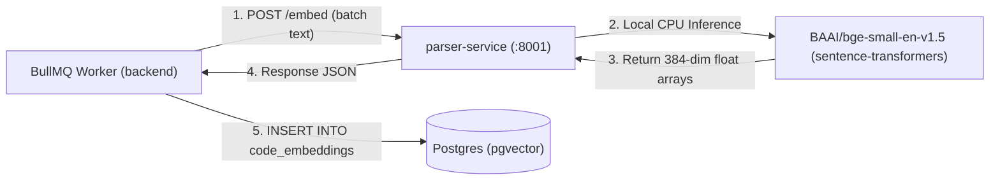

# RFC 0008: Embedding Generation & Storage — Local BAAI/bge-small-en-v1.5 + pgvector

| Metadata | Details |
|---|---|
| **Status** | Proposed |
| **Phase** | 1 (Step 8) |
| **Date** | 2026-09 |
| **Author** | CodeCortex team |
| **Affects** | `parser-service/app/embeddings.py`, `backend/prisma/schema.prisma`, `backend/src/jobs/pipeline/generate-embeddings.ts` |
| **Depends on** | [RFC 0001](file:///e:/Projects/CodeCortex/docs/rfcs/0001-service-topology.md), [RFC 0003](file:///e:/Projects/CodeCortex/docs/rfcs/0003-phase-0-data-model.md), [RFC 0006](file:///e:/Projects/CodeCortex/docs/rfcs/0006-parsing-microservice.md) |

---

## Summary

> [!IMPORTANT]
> CodeCortex generates 384-dimensional dense semantic embeddings locally using the **`BAAI/bge-small-en-v1.5`** model hosted inside `parser-service/` (`POST /embed`). Embeddings are persisted to Postgres using the **`pgvector`** extension in the `code_embeddings` table. No source code or chunk text is ever transmitted to external third-party embedding APIs.

---

## Terminology

- **Vector Embedding:** A numerical dense vector representation capturing semantic meaning in high-dimensional space.
- **`pgvector`:** An open-source Postgres extension enabling vector storage, indexing, and vector similarity search directly within Postgres.
- **Cosine Distance (`<=>`):** A mathematical metric measuring the angular similarity between two normalized vectors in dimensional space.
- **Local Embedding Execution:** Running model inference on self-managed CPU/GPU infrastructure without external API roundtrips.

---

## Motivation

### The problem this RFC solves
Exact graph matching (Neo4j) captures structural relationships, but cannot answer natural-language questions where the user does not know exact symbol names (e.g. "where do we handle authentication cookies"). Semantic vector retrieval bridges this gap by locating relevant code snippets based on semantic similarity.

### Why this can't be deferred
Running embeddings locally using `BAAI/bge-small-en-v1.5` enforces CodeCortex's privacy core guarantee: code content never leaves user-controlled infrastructure. Storing vectors in Postgres via `pgvector` avoids introducing a separate standalone vector database (like Pinecone or Qdrant), keeping operational overhead minimal.

---

## Detailed Design

### System Pipeline Flow



### `parser-service/` Vector Inference Endpoint (`POST /embed`)

```python
# Pydantic schema in parser-service/app/schemas.py
class EmbedRequest(BaseModel):
    texts: list[str] = Field(..., description="Array of code chunks or symbol docstrings to embed")

class EmbedResponse(BaseModel):
    embeddings: list[list[float]] = Field(..., description="Array of 384-dimensional floating point vectors")
```

### Postgres Schema & Migration (`backend/prisma/schema.prisma`)

```prisma
model CodeEmbedding {
  id              String       @id @default(uuid())
  connectedRepoId String       @map("connected_repo_id")
  entityType      String       @map("entity_type") // 'function' | 'class' | 'file'
  entityName      String       @map("entity_name")
  filePath        String       @map("file_path")
  contentChunk    String       @map("content_chunk") @db.Text
  createdAt       DateTime     @default(now()) @map("created_at")

  connectedRepo   ConnectedRepo @relation(fields: [connectedRepoId], references: [id], onDelete: Cascade)

  @@index([connectedRepoId])
  @@map("code_embeddings")
}
```

> [!NOTE]
> Because Prisma does not natively manage native `vector` data types in its schema DSL, the `embedding` vector column is added via a custom Prisma migration SQL script:
> `ALTER TABLE code_embeddings ADD COLUMN embedding vector(384);`

### Parameterized Vector Insert & Search Queries (`generate-embeddings.ts`)

```typescript
// Insert batch embeddings using Prisma tagged template literals ($executeRaw)
for (const item of batch) {
  const vectorString = `[${item.embedding.join(",")}]`;
  await prisma.$executeRaw`
    INSERT INTO code_embeddings (id, connected_repo_id, entity_type, entity_name, file_path, content_chunk, embedding, created_at)
    VALUES (gen_random_uuid(), ${repoId}, ${item.entityType}, ${item.entityName}, ${item.filePath}, ${item.contentChunk}, ${vectorString}::vector, NOW())
  `;
}

// Vector similarity search query scoped strictly by connectedRepoId
export async function searchSemantic(repoId: string, queryVector: number[], limit = 5) {
  const vectorString = `[${queryVector.join(",")}]`;
  return prisma.$queryRaw`
    SELECT id, entity_type, entity_name, file_path, content_chunk,
           (embedding <=> ${vectorString}::vector) AS distance
    FROM code_embeddings
    WHERE connected_repo_id = ${repoId}
    ORDER BY embedding <=> ${vectorString}::vector ASC
    LIMIT ${limit};
  `;
}
```

---

## Implementation Plan

1. Enable `vector` extension in Postgres: `CREATE EXTENSION IF NOT EXISTS vector;`.
2. Add `sentence-transformers` and `torch` to `parser-service/requirements.txt`.
3. Implement `parser-service/app/embeddings.py` loading `BAAI/bge-small-en-v1.5`.
4. Update Prisma schema in `backend/prisma/schema.prisma` and run migration adding `CodeEmbedding` table and `vector(384)` column.
5. Implement `backend/src/jobs/pipeline/generate-embeddings.ts` using `BATCH_SIZE = 50`.

---

## Alternatives Considered

| Option | Pros | Cons | Verdict |
|---|---|---|---|
| **OpenAI `text-embedding-3-small` API** | High quality, zero CPU load | Violates privacy constraint (sends private code to 3rd party API) | **Rejected** |
| **Standalone Vector DB (Pinecone/Qdrant)** | Dedicated vector indexing algorithms | Introduces 4th datastore dependency and sync overhead | **Rejected** |
| **Local `bge-small-en-v1.5` + Postgres `pgvector`** | 100% private, zero extra datastores, fast 384-dim similarity | Moderately higher CPU usage during ingestion | **Proposed** |

---

## Security Considerations

> [!CAUTION]
> - Source code chunks and embeddings MUST NOT be sent to external cloud APIs under any circumstances.
> - All `pgvector` queries MUST explicitly include `WHERE connected_repo_id = ${repoId}` to prevent cross-tenant vector leakage.

---

## Success Criteria

- `parser-service/` generates 384-dim embedding arrays via `POST /embed`.
- `pgvector` extension initializes cleanly in Postgres.
- `searchSemantic()` returns relevant code chunks ordered by cosine distance in $<20$ ms.
