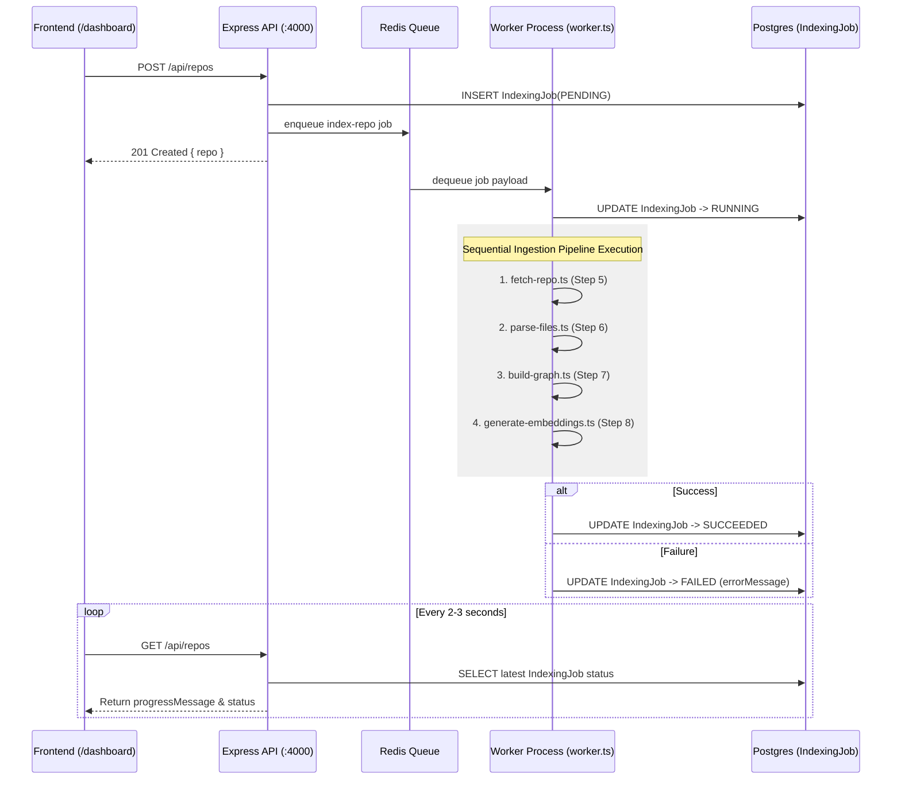

# RFC 0009: Ingestion Job Orchestration — BullMQ + Redis Queue System

| Metadata | Details |
|---|---|
| **Status** | Proposed |
| **Phase** | 1 (Step 9) |
| **Date** | 2026-09 |
| **Author** | CodeCortex team |
| **Affects** | `backend/src/jobs/queue.ts`, `backend/src/jobs/worker.ts`, `backend/src/routes/repos.ts` |
| **Depends on** | [RFC 0001](file:///e:/Projects/CodeCortex/docs/rfcs/0001-service-topology.md), [RFC 0003](file:///e:/Projects/CodeCortex/docs/rfcs/0003-phase-0-data-model.md), [RFC 0005](file:///e:/Projects/CodeCortex/docs/rfcs/0005-repo-fetching-strategy.md), [RFC 0006](file:///e:/Projects/CodeCortex/docs/rfcs/0006-parsing-microservice.md), [RFC 0007](file:///e:/Projects/CodeCortex/docs/rfcs/0007-graph-database-and-schema.md), [RFC 0008](file:///e:/Projects/CodeCortex/docs/rfcs/0008-embedding-generation.md) |

---

## Summary

> [!IMPORTANT]
> CodeCortex orchestrates multi-step repository ingestion jobs asynchronously using **BullMQ** backed by **Redis**. The Express API process enqueues lightweight job payloads into the queue upon user connection; a separate worker entrypoint (`backend/src/jobs/worker.ts`) dequeues jobs and sequentially executes pipeline stages 5 through 8 while reflecting progress to Postgres (`IndexingJob`).

---

## Terminology

- **BullMQ:** A fast, robust TypeScript queue system for Node.js based on Redis.
- **Job Payload:** Minimal JSON metadata passed through Redis containing entity IDs (`indexingJobId`, `connectedRepoId`).
- **State Machine Transitions:** Status lifecycle progression (`PENDING` $\rightarrow$ `RUNNING` $\rightarrow$ `SUCCEEDED` / `FAILED`).
- **Worker Process Isolation:** Running worker execution in a separate Node.js process to isolate intensive CPU/IO tasks from the HTTP server event loop.

---

## Motivation

### The problem this RFC solves
Repository ingestion involves cloning git repos, parsing hundreds of files over HTTP, executing Neo4j Cypher writes, and generating vector embeddings. Running this sequentially within an Express HTTP request handler would cause client HTTP timeouts (30s+), block the single-threaded Node.js event loop, and crash requests.

### Why this can't be deferred
Establishing job orchestration ties together pipeline stages 5, 6, 7, and 8 into a coherent, reliable automated workflow with error handling, progress reporting, and state persistence.

---

## Detailed Design

### Pipeline Sequence Diagram



### Queue Definition (`backend/src/jobs/queue.ts`)

```typescript
import { Queue } from "bullmq";
import Redis from "ioredis";

export const connection = new Redis(process.env.REDIS_URL || "redis://localhost:6379");

export interface IndexRepoJobPayload {
  indexingJobId: string;
  connectedRepoId: string;
}

export const indexRepoQueue = new Queue<IndexRepoJobPayload>("index-repo", { connection });
```

### Worker Entrypoint (`backend/src/jobs/worker.ts`)

```typescript
import { Worker, Job } from "bullmq";
import { fetchRepo, cleanupRepo } from "./pipeline/fetch-repo";
import { parseFiles } from "./pipeline/parse-files";
import { buildGraph } from "./pipeline/build-graph";
import { generateEmbeddings } from "./pipeline/generate-embeddings";
import { prisma } from "../lib/prisma";

export const indexWorker = new Worker<IndexRepoJobPayload>(
  "index-repo",
  async (job: Job<IndexRepoJobPayload>) => {
    const { indexingJobId, connectedRepoId } = job.data;

    // 1. Mark status RUNNING
    await prisma.indexingJob.update({
      where: { id: indexingJobId },
      data: { status: "RUNNING", progressMessage: "Cloning repository..." },
    });

    let workspacePath = "";
    try {
      // Step 5: Fetch Repo
      const fetchResult = await fetchRepo({ indexingJobId, connectedRepoId });
      workspacePath = fetchResult.workspacePath;

      // Step 6: Parse Files
      await prisma.indexingJob.update({
        where: { id: indexingJobId },
        data: { progressMessage: "Parsing Abstract Syntax Trees..." },
      });
      const parseResult = await parseFiles({ files: fetchResult.files });

      // Step 7: Build Neo4j Graph
      await prisma.indexingJob.update({
        where: { id: indexingJobId },
        data: { progressMessage: "Building structural Neo4j graph..." },
      });
      await buildGraph({ repoId: connectedRepoId, facts: parseResult });

      // Step 8: Generate Vector Embeddings
      await prisma.indexingJob.update({
        where: { id: indexingJobId },
        data: { progressMessage: "Generating semantic vector embeddings..." },
      });
      await generateEmbeddings({ repoId: connectedRepoId, facts: parseResult });

      // Mark status SUCCEEDED
      await prisma.indexingJob.update({
        where: { id: indexingJobId },
        data: { status: "SUCCEEDED", progressMessage: "Indexing completed successfully." },
      });
    } catch (err: any) {
      // Mark status FAILED with error explanation
      await prisma.indexingJob.update({
        where: { id: indexingJobId },
        data: { status: "FAILED", errorMessage: err.message || "Pipeline execution failed" },
      });
      throw err;
    } finally {
      if (workspacePath) {
        await cleanupRepo(workspacePath);
      }
    }
  },
  { connection }
);
```

---

## Implementation Plan

1. Install `bullmq` and `ioredis` in `backend/package.json`.
2. Add `REDIS_URL` to `backend/.env.example`.
3. Implement `backend/src/jobs/queue.ts` export singleton.
4. Implement `backend/src/jobs/worker.ts` with complete pipeline execution logic.
5. Update `POST /api/repos` in `backend/src/routes/repos.ts` to enqueue `index-repo` jobs.

---

## Alternatives Considered

| Option | Pros | Cons | Verdict |
|---|---|---|---|
| **Synchronous In-Handler Execution** | Zero queue infrastructure | Times out HTTP connections, crashes API process | **Rejected** |
| **AWS SQS / Cloud Queues** | Managed cloud infrastructure | Requires cloud provider coupling for local dev | **Rejected** |
| **BullMQ + Redis** | Open source, fast, TypeScript native, simple local Docker setup | Requires running a Redis container | **Proposed** |

---

## Security Considerations

> [!CAUTION]
> - BullMQ job payloads MUST contain minimal IDs (`indexingJobId`, `connectedRepoId`), NEVER secrets, access tokens, or code strings.
> - Redis instance MUST be protected with authentication in non-local environments.

---

## Success Criteria

- `POST /api/repos` enqueues job and returns `201 Created` in $<50$ ms.
- Worker process dequeues job, executes pipeline steps 5–8 sequentially, and transitions `IndexingJob.status` from `PENDING` $\rightarrow$ `RUNNING` $\rightarrow$ `SUCCEEDED`.
- Workspace directory cleanup runs in the `finally` block on both success and failure.
