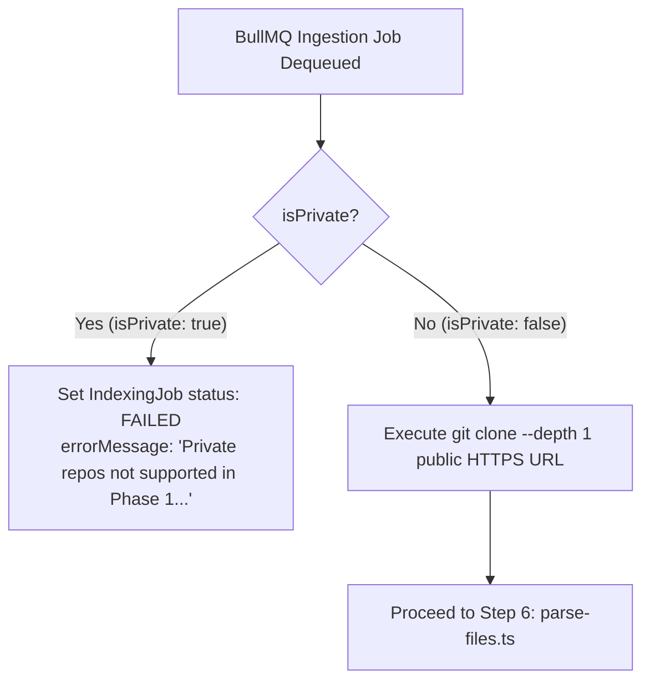

# RFC 0010: Private Repository Access Strategy — Scoping & Credential Handling

| Metadata | Details |
|---|---|
| **Status** | Proposed |
| **Phase** | 1 (Step 10 / Security Boundary) |
| **Date** | 2026-09 |
| **Author** | CodeCortex team |
| **Affects** | `backend/src/jobs/pipeline/fetch-repo.ts`, `backend/src/middleware/requireAuth.ts`, security boundaries |
| **Depends on** | [RFC 0001](file:///e:/Projects/CodeCortex/docs/rfcs/0001-service-topology.md), [RFC 0002](file:///e:/Projects/CodeCortex/docs/rfcs/0002-authentication.md), [RFC 0005](file:///e:/Projects/CodeCortex/docs/rfcs/0005-repo-fetching-strategy.md), [RFC 0009](file:///e:/Projects/CodeCortex/docs/rfcs/0009-job-orchestration.md) |

---

## Summary

> [!IMPORTANT]
> To uphold CodeCortex's strict security invariant ([RFC 0002](file:///e:/Projects/CodeCortex/docs/rfcs/0002-authentication.md))—which mandates that GitHub access tokens reside **only** in HTTP-only JWT session cookies and **must never be persisted** to any database or durable queue—Phase 1 repository ingestion is explicitly scoped to **Public Repositories Only**. Submitting a private repository in Phase 1 triggers an explicit, immediate `FAILED` job status with a human-readable explanation, preserving token non-persistence without quiet workarounds.

---

## Terminology

- **Token Non-Persistence Invariant:** Security rule prohibiting saving OAuth access tokens to database columns, Redis job payloads, or disk logs.
- **Out-of-Band Worker Execution:** Background processing (BullMQ worker) executing asynchronously outside the lifecycle of an HTTP request.
- **Transient Credential Injection:** Passing a credential temporarily in memory during execution without writing it to durable storage.

---

## Motivation

### The problem this RFC solves
When a user connects a repository via `POST /api/repos`, their GitHub access token exists in `req.githubAccessToken` derived from the JWT session cookie. However, the background BullMQ worker process ([RFC 0009](file:///e:/Projects/CodeCortex/docs/rfcs/0009-job-orchestration.md)) dequeues jobs asynchronously without an HTTP request or user session context.

Without stored credentials, the worker cannot authenticate against private GitHub repositories during `git clone`.

### Why this can't be deferred
Ad-hoc workarounds (such as saving the access token to Postgres `users` or Redis job payloads) violate core security rules. Deciding the Phase 1 boundary explicitly upfront guarantees system integrity and prevents security compromises.

---

## Detailed Design

### Phase 1 System Boundary



### Phase 1 Public-Only Enforcement Contract (`fetch-repo.ts`)

```typescript
// Enforced inside backend/src/jobs/pipeline/fetch-repo.ts
if (repo.isPrivate) {
  throw new Error(
    "Private repositories are not supported in Phase 1 ingestion. " +
    "GitHub access tokens are not persisted to database storage for security."
  );
}
```

### Future Resolution Roadmap (Phase 5 / RFC 0021)

For production deployments requiring private repository support, Phase 5 will introduce a dedicated credential management strategy:

| Future Strategy | Architectural Mechanism | Security Guarantee |
|---|---|---|
| **KMS Encrypted Storage** | Encrypt access tokens using AES-256-GCM / AWS KMS before storing in Postgres. | Restricts token decryption keys strictly to worker IAM role. |
| **GitHub App Installation Tokens** | Short-lived (1-hour) installation tokens minted on demand via GitHub App integration. | Eliminates long-lived personal access tokens. |
| **Transient In-Memory Queue Token** | Encrypt token in Redis job payload with a short TTL (10 mins). | Token expires automatically after worker dequeues payload. |

---

## Implementation Plan

1. Document the Phase 1 public-only scope decision in `backend/src/jobs/pipeline/fetch-repo.ts`.
2. Add explicit error handling in `fetch-repo.ts` checking `repo.isPrivate`.
3. Verify that connecting a private repo sets `IndexingJob.status = "FAILED"` with the documented error message.

---

## Alternatives Considered

| Option | Pros | Cons | Verdict |
|---|---|---|---|
| **Persist Access Token in Postgres `User` Table** | Solves private repo cloning easily | Violates security rule 1002/1005, high risk of token leak | **Rejected** |
| **Pass Plaintext Token in BullMQ Job Payload** | Simple implementation | Plaintext tokens sit in Redis persistence dump files | **Rejected** |
| **Public Repos Only for Phase 1** | 100% security compliant, zero token leaks, clean scope boundary | Deferred private repo indexing to Phase 5 | **Proposed** |

---

## Security Considerations

> [!CAUTION]
> - Never persist GitHub access tokens to Postgres, Redis, Neo4j, or server logs.
> - Do not bypass the `repo.isPrivate` check with ad-hoc token persistence in Phase 1.

---

## Success Criteria

- Public repositories index seamlessly without requiring saved access tokens.
- Attempting to index a private repository fails immediately with the explicit error message.
- No access tokens appear in database tables, Redis keys, or system log outputs.
