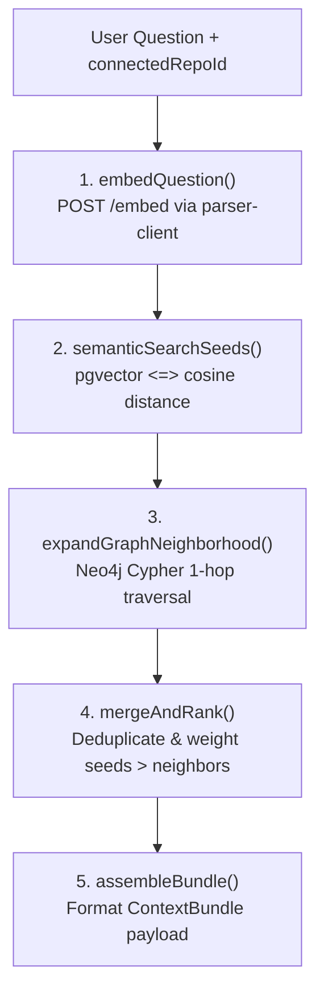

# RFC 0011: Hybrid Retrieval — Merging pgvector Semantic Search with Neo4j Graph Traversal

| Metadata | Details |
|---|---|
| **Status** | Proposed |
| **Phase** | 2 (Step 11) |
| **Date** | 2026-09 |
| **Author** | CodeCortex team |
| **Affects** | `backend/src/lib/retrieval.ts` |
| **Depends on** | [RFC 0001](file:///e:/Projects/CodeCortex/docs/rfcs/0001-service-topology.md), [RFC 0007](file:///e:/Projects/CodeCortex/docs/rfcs/0007-graph-database-and-schema.md), [RFC 0008](file:///e:/Projects/CodeCortex/docs/rfcs/0008-embedding-generation.md) |

---

## Summary

> [!IMPORTANT]
> CodeCortex implements hybrid retrieval inside `backend/src/lib/retrieval.ts` by taking a natural-language question and a `connectedRepoId`, executing semantic vector search against `pgvector` (`bge-small-en-v1.5`) to locate seed nodes, expanding each hit outward through the Neo4j graph (callers, callees, and containing files), and assembling one merged, ranked **Context Bundle**. This function operates deterministically with zero LLM calls.

---

## Terminology

- **Hybrid Retrieval:** Combining two distinct retrieval signals—semantic similarity (vector embeddings) and structural relationship (graph traversal)—into a single context result set.
- **Seed Nodes:** The initial top-$K$ graph entities located via semantic vector search from which structural graph expansion originates.
- **Graph Neighborhood Expansion:** Bounded Cypher traversal outward from seed nodes along `:CALLS`, `:DEFINES`, and `:IMPORTS` relationships.
- **Context Bundle:** The final assembled payload of ranked code snippets and structural facts supplied as grounding context for downstream LLM agents (Phase 3).

---

## Motivation

### The problem this RFC solves
Semantic search alone finds code that *reads like* a user's question, but misses critical structural dependencies (e.g. "what functions break if I change X"). Graph traversal alone provides exact call hierarchies, but cannot locate starting points from vague natural-language questions. Combining both signals resolves their mutual blind spots.

### Why this must be built and verified before any LLM call exists

> [!CAUTION]
> If retrieval quality is flawed, downstream LLM agents will produce convincingly wrong answers. Building and hand-verifying `hybridRetrieve()` deterministically without LLM calls guarantees that context quality is validated in isolation before model fluency masks underlying retrieval bugs.

---

## Detailed Design

### System Pipeline Architecture



### TypeScript Data Contracts (`backend/src/lib/retrieval.ts`)

```typescript
export interface HybridRetrieveParams {
  connectedRepoId: string;
  question: string;
  maxSeeds?: number;      // default: 5
  expansionHops?: number; // default: 1
}

export interface ContextNode {
  id: string;
  entityType: "function" | "class" | "file";
  entityName: string;
  filePath: string;
  contentChunk: string;
  score: number;
  isSeed: boolean;
  callers: string[];
  callees: string[];
}

export interface ContextBundle {
  connectedRepoId: string;
  question: string;
  nodes: ContextNode[];
  totalSeedNodes: number;
  totalExpandedNodes: number;
}
```

### Decomposed Sub-Functions

1. **`embedQuestion(question: string)`**: Calls `embedTextsWithService([question])` ([RFC 0008](file:///e:/Projects/CodeCortex/docs/rfcs/0008-embedding-generation.md)) using the local `BAAI/bge-small-en-v1.5` model to produce a 384-dimensional query vector.
2. **`semanticSearchSeeds(repoId, queryVector, maxSeeds)`**: Runs `searchSemantic()` against `pgvector` scoped by `connectedRepoId` to return the top `maxSeeds` code chunks.
3. **`expandGraphNeighborhood(repoId, seeds, hops)`**: Executes Cypher queries against Neo4j ([RFC 0007](file:///e:/Projects/CodeCortex/docs/rfcs/0007-graph-database-and-schema.md)) matching incoming caller functions (`(:Function)-[:CALLS]->(seed)`), outgoing callee functions (`(seed)-[:CALLS]->(:Function)`), and containing file definitions.
4. **`mergeAndRank(seeds, neighbors)`**: Deduplicates entities, assigns higher weight to direct semantic seeds relative to 1-hop structural neighbors, and ranks final items by relevance score.
5. **`assembleBundle(rankedNodes)`**: Builds the formatted `ContextBundle` payload suitable for agent prompt injection.

---

## Implementation Plan

1. Create `backend/src/lib/retrieval.ts` implementing `hybridRetrieve()` and sub-functions.
2. Create `backend/src/__tests__/retrieval.test.ts` Vitest suite mocking parser service vector embedding and Neo4j session queries.
3. Perform manual verification against indexed test repositories with semantic, structural, and mixed test queries.

---

## Alternatives Considered

| Option | Pros | Cons | Verdict |
|---|---|---|---|
| **Semantic Vector Search Only** | Simple setup | Misses caller/callee structural dependencies | **Rejected** |
| **Graph Traversal Only** | Exact structural relationships | Cannot locate entrypoints from natural-language queries | **Rejected** |
| **Hybrid: Semantic Seeds + Bounded Graph Expansion** | Solves both blind spots, keeps context size predictable | Slightly higher query composition complexity | **Proposed** |

---

## Security Considerations

> [!CAUTION]
> - All `pgvector` raw SQL queries MUST filter strictly by `WHERE connected_repo_id = ${repoId}`.
> - All Neo4j Cypher queries MUST filter strictly by `repoId: $repoId` on every node pattern.

---

## Success Criteria

- `hybridRetrieve()` returns a structured `ContextBundle` combining direct vector seeds and 1-hop Neo4j callers/callees.
- All unit and integration tests pass cleanly with 100% type safety.
