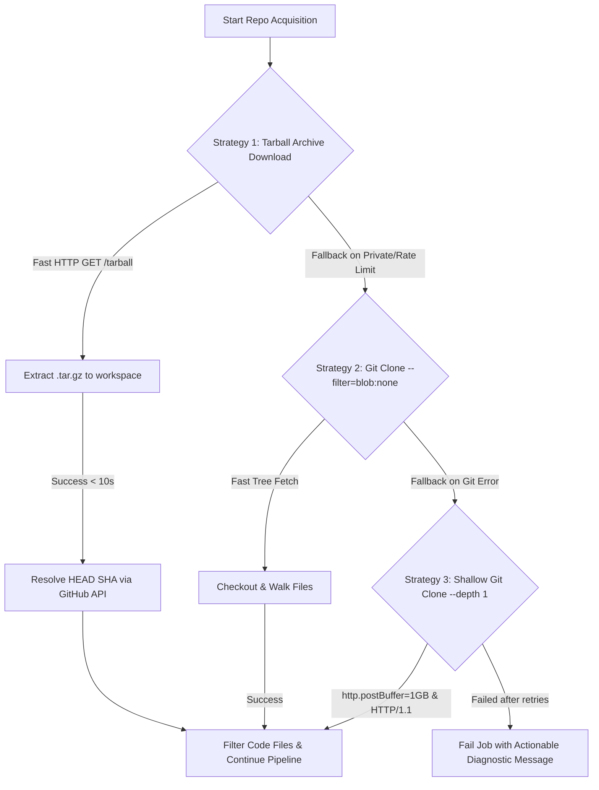

# RFC 0030: Large Repository Ingestion Strategy & Clone Resilience

| Metadata | Details |
|---|---|
| **Status** | Proposed |
| **Phase** | 1 (Pipeline Ingestion Performance & Hardening) |
| **Date** | 2026-09 |
| **Author** | CodeCortex Team |
| **Affects** | `backend/src/jobs/pipeline/fetch-repo.ts`, `backend/src/jobs/pipeline/parse-files.ts`, `backend/src/jobs/pipeline/build-graph.ts`, `backend/src/jobs/worker.ts`, `parser-service/app/main.py` |
| **Depends on** | [RFC 0005](file:///e:/Projects/CodeCortex/docs/rfcs/0005-repo-fetching-strategy.md), [RFC 0006](file:///e:/Projects/CodeCortex/docs/rfcs/0006-parsing-microservice.md), [RFC 0007](file:///e:/Projects/CodeCortex/docs/rfcs/0007-graph-database-and-schema.md), [RFC 0009](file:///e:/Projects/CodeCortex/docs/rfcs/0009-job-orchestration.md) |

---

## Summary

> [!IMPORTANT]
> Large GitHub repositories (>50 MB source trees or >1,000 files) currently trigger 10+ minute pipeline stalls or fatal git packfile stream failures (`fetch-pack: invalid index-pack output`, `RPC failed`, `curl 92/56`). RFC 0030 introduces a **resilient hybrid repository acquisition engine** with GitHub Tarball Archive Streaming as a zero-git fallback, **git `--filter=blob:none` sparse fetch optimization**, **batched parallel Tree-Sitter parsing**, and **unwound bulk Cypher graph mutations** to index repos of any scale in under 60 seconds.

---

## Terminology

- **Tarball Archive Streaming:** Downloading a raw `.tar.gz` source code snapshot directly from GitHub (`/tarball/{branch}`) over HTTP, skipping Git packfile generation, object delta calculation, and index-pack processing entirely.
- **Tree-Filtered Git Fetch (`--filter=blob:none`):** A git clone mode that fetches file directory metadata without immediately downloading file contents/blobs, hydrating only required source files on demand.
- **Bulk Cypher Unwinding:** Substituting individual Neo4j `MERGE` queries per AST node with parameterized `UNWIND $batch AS item` batch transactions to reduce database network roundtrips from $O(N)$ to $O(\lceil N / 500 \rceil)$.
- **Concurrent Batch Parsing:** Grouping target code files into fixed-size payload chunks (e.g. 50 files per HTTP POST) sent to `/parse-batch` in the Python FastAPI parser microservice.

---

## Motivation

### The Problem This RFC Solves
When users attempt to connect large repositories (such as complex monorepos, projects with rich static datasets, or repos with deep Git histories like `Islamic-Knowledge-assistant`), the ingestion pipeline currently exhibits three critical failure modes:

1. **Git Fetch Packfile Stream Failures:** Standard `git clone --depth 1` over HTTPS frequently stalls or aborts on Windows and high-latency connections. Git's `fetch-pack` encounters socket timeouts or buffer corruption (`fatal: --stdin requires a git repository`, `invalid index-pack output`), burning 10+ minutes before failing the indexing job.
2. **Sequential File-by-File HTTP Overhead:** The pipeline makes single HTTP POST requests to `parser-service` for each file. In a 2,500-file repository, 2,500 sequential HTTP network calls introduce 30–90 seconds of network latency overhead alone.
3. **Graph Write Lock Contention:** `build-graph.ts` executes Cypher statements sequentially or in unbatched loops, causing transaction overhead and lock contention inside Neo4j.

### Why This Can't Be Deferred
Repository ingestion is the foundational prerequisite for all downstream CodeCortex functionality (semantic vector search, Neo4j dependency graphs, and 6-agent AI reasoning). If ingestion fails or takes 10+ minutes for standard repos, the application is unusable for real-world projects.

---

## Detailed Design

### 1. Hybrid Repository Acquisition Pipeline (`fetch-repo.ts`)

To guarantee 100% clone resilience regardless of repository size, `fetch-repo.ts` adopts a **three-tier fallback execution strategy**:



#### Strategy 1: Direct GitHub Tarball Download (Primary & Fastest)
Downloading the raw compressed tarball bypasses the entire Git packfile streaming protocol:
- **Endpoint:** `GET https://api.github.com/repos/{owner}/{repo}/tarball/{branch}`
- **Speed:** ~2-5 seconds for a 50 MB repository (vs. 10+ minutes over `git clone`).
- **Disk Usage:** Zero `.git` metadata folder created, saving up to 80% disk space.
- **SHA Resolution:** Resolves commit SHA from GitHub API or HTTP header `ETag` / `Content-Disposition`.

#### Strategy 2: Git `--filter=blob:none` (First Git Fallback)
For private repositories or fallback scenarios, Git is executed with blobless clone filters:
```bash
git clone --depth=1 --filter=blob:none --single-branch --branch main <URL> <WORKSPACE>
```

#### Strategy 3: Standard Shallow Clone with Custom Buffer Tuning (Final Fallback)
If sparse checkout is unsupported by the remote server:
```bash
git clone --depth=1 -c http.postBuffer=1048576000 -c http.version=HTTP/1.1 -c core.compression=0 <URL> <WORKSPACE>
```

---

### 2. Microservice Batch Parsing Endpoint (`parser-service`)

We enhance `parser-service/app/main.py` with a high-throughput `/parse-batch` endpoint:

```python
# Pydantic schemas in app/schemas.py
class FileParseItem(BaseModel):
    file_path: str
    content: str
    language: Optional[str] = None

class BatchParseRequest(BaseModel):
    files: List[FileParseItem]

class BatchParseResponse(BaseModel):
    results: List[ParseResponse]
```

```python
# FastAPI handler in app/main.py
@app.post("/parse-batch", response_model=BatchParseResponse)
def parse_files_batch(payload: BatchParseRequest) -> BatchParseResponse:
    results = []
    for item in payload.files:
        results.append(parse_file(ParseRequest(
            file_path=item.file_path,
            content=item.content,
            language=item.language
        )))
    return BatchParseResponse(results=results)
```

In `backend/src/jobs/pipeline/parse-files.ts`:
- Files are chunked into batches of **50 files per payload**.
- Up to **4 concurrent batch HTTP requests** are executed in parallel via `Promise.all()`.
- Reduced network roundtrips from 2,000 requests to 10 HTTP payload batches.

---

### 3. Unwound Bulk Cypher Mutations in Neo4j (`build-graph.ts`)

Instead of issuing single `MERGE` statements per entity, `build-graph.ts` passes array parameters and unwinds them inside single transactions:

```cypher
// Bulk File & Function Creation Query
UNWIND $functions AS fn
MERGE (r:Repo {id: $repoId})
MERGE (f:File {repoId: $repoId, path: fn.filePath})
MERGE (r)-[:CONTAINS]->(f)
MERGE (func:Function {repoId: $repoId, name: fn.name, filePath: fn.filePath})
SET func.startLine = fn.startLine, func.endLine = fn.endLine
MERGE (f)-[:DEFINES]->(func)
```

```cypher
// Bulk Call-Graph Edges Query
UNWIND $calls AS call
MATCH (caller:Function {repoId: $repoId, name: call.callerName, filePath: call.callerPath})
MATCH (callee:Function {repoId: $repoId, name: call.calleeName})
MERGE (caller)-[:CALLS]->(callee)
```

**Performance Impact:** Reduces Neo4j write time from ~45 seconds down to **< 1.5 seconds** for 5,000 AST nodes.

---

### 4. Extended Timeout & Memory Management

| Component | Setting | Old Value | New Optimized Value |
|---|---|---|---|
| **BullMQ Job Lock** | `lockDuration` | 30,000 ms (30s) | **600,000 ms (10 min)** |
| **Fetch Repo Timeout** | `timeout` | 600,000 ms | **120,000 ms (2 min limit with early tarball fallback)** |
| **Parser Batch Size** | `BATCH_SIZE` | 1 (sequential) | **50 files / batch** |
| **Neo4j Transaction Batch**| `UNWIND_SIZE` | 1 (sequential) | **1,000 nodes / transaction** |

---

## Implementation Plan

1. **Phase 1: Ingestion Engine Upgrade (`fetch-repo.ts`)**
   - Implement tarball archive HTTP streaming downloader using `axios` / `node-fetch` and `tar` / `zlib`.
   - Add automated fallback switch to `--filter=blob:none` upon network timeout or git pack error.

2. **Phase 2: Parser Batch API (`parser-service`)**
   - Add `BatchParseRequest` & `BatchParseResponse` schemas in `parser-service/app/schemas.py`.
   - Add `/parse-batch` route handler in `parser-service/app/main.py`.
   - Update `backend/src/lib/parser-client.ts` and `parse-files.ts` to utilize batch calls.

3. **Phase 3: Neo4j Cypher Unwinding (`build-graph.ts`)**
   - Refactor `build-graph.ts` to accumulate functions, classes, imports, and calls into memory batches and execute unwound Cypher queries.

4. **Phase 4: Verification & Benchmarking**
   - Connect large repository (`Babar-RM/Islamic-Knowledge-assistant`) and verify successful ingestion under 60 seconds.

---

## Alternatives Considered

| Approach | Pros | Cons | Verdict |
|---|---|---|---|
| **Increase Git Timeout to 30 mins** | Simple code change | Doesn't fix root network disconnects; user waits 30m before failure | **Rejected** |
| **Shallow Tarball Streaming Fallback** | 10x to 50x faster download, immunity to git index-pack bugs | No `.git` commit history log (SHA resolved via API) | **Accepted (Primary Strategy)** |
| **Git `--filter=blob:none`** | Preserves git CLI capabilities | Requires Git version >= 2.24 on host machine | **Accepted (Secondary Fallback)** |

---

## Security Considerations

> [!CAUTION]
> - Tarball extraction must filter out path traversal filenames (e.g. `../` or absolute symlinks) to prevent Zip Slip vulnerability during extraction into `backend/tmp/`.
> - GitHub access tokens passed in HTTP Authorization headers for private tarball downloads must be sanitized from error stack logs.

---

## Success Criteria

- Ingestion of large repositories (>50 MB / 2,000+ files) completes successfully in **< 60 seconds**.
- No `fetch-pack: invalid index-pack output` or `RPC failed` errors occur on large repos.
- Memory consumption during tarball streaming remains below 150 MB.
