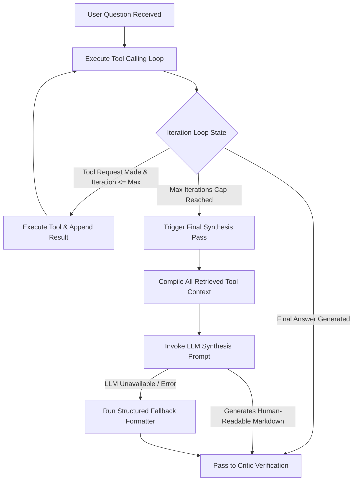

# RFC 0031: Agent Response Synthesis, Graceful Fallbacks & Formatting Standards

| Metadata | Details |
|---|---|
| **Status** | Proposed |
| **Phase** | 3 & 6 (Multi-Agent System & UI Response Quality) |
| **Date** | 2026-09 |
| **Author** | CodeCortex Team |
| **Affects** | `backend/src/lib/agents/agent-loop.ts`, `backend/src/lib/agents/orchestrator.ts`, `backend/src/lib/agents/agents/critic-agent.ts`, `frontend/components/ChatBox.tsx` |
| **Depends on** | [RFC 0014](file:///e:/Projects/CodeCortex/docs/rfcs/0014-specialist-agents-and-tools.md), [RFC 0015](file:///e:/Projects/CodeCortex/docs/rfcs/0015-critic-agent.md), [RFC 0022](file:///e:/Projects/CodeCortex/docs/rfcs/0022-structured-logging-and-agent-trace.md), [RFC 0025](file:///e:/Projects/CodeCortex/docs/rfcs/0025-chat-interface-architecture.md) |

---

## Summary

> [!IMPORTANT]
> When multi-agent investigations hit tool iteration caps or process broad repository queries (e.g. *"what are the security loop holes"*), the engine currently outputs raw, unparsed developer debug strings (`[Note: Specialist investigation reached the maximum iteration cap of 6.]`, `Content & structure for file 'README.md':`). RFC 0031 establishes a mandatory **Final Synthesis Pass**, enforces strict separation between internal trace metadata and user-facing Markdown answers, and introduces **Structured Natural-Language Fallbacks** so every response is clean, professional, human-readable, and actionable.

---

## Terminology

- **Final Synthesis Pass:** An explicit single-turn LLM completion executed at the end of a tool loop to compile all retrieved graph facts, tool outputs, and search snippets into a clean Markdown answer.
- **Trace Leakage:** The accidental inclusion of internal agent loop control metadata (iteration counters, raw JSON tool arguments, system warning notes) in the user-visible answer body.
- **Structured Fallback Formatter:** A deterministic Markdown compiler used when an agent loop hits iteration caps or when LLM API keys are missing/rate-limited, converting raw context facts into structured executive summaries and code insights.
- **Broad Query Decomposition:** The strategy of breaking high-level security or architecture questions into targeted multi-tool investigations (inspecting dependencies, auth logic, database queries, and input validation).

---

## Motivation

### The Problem This RFC Solves
In complex agent investigations (such as auditing security vulnerabilities or reviewing multi-file architectures):
1. **Unformatted Raw Output Leakage:** When an agent reaches its iteration limit (`maxIterations = 6`), `agent-loop.ts` returns a string concatenation of raw tool output headers (`[Note: Specialist...]`, `Content & structure for file 'README.md':`) instead of a synthesized natural-language response.
2. **Redundant Tool Retries:** For broad questions like *"what are the security loop holes"*, specialists repeatedly query identical files (e.g., `README.md`) multiple times without expanding search scope to route handlers, authentication modules, or database configurations.
3. **Degraded User Experience:** Presenting technical debug logs in the main response window breaks visual elegance, confuses users, and makes CodeCortex look unpolished.

### Why This Can't Be Deferred
CodeCortex's primary value proposition is providing **verifiable, accurate, and human-readable code insights**. Raw debug dumps violate core design principles and compromise answer quality.

---

## Detailed Design

### 1. Mandatory Final Synthesis Pass Architecture

Instead of returning raw tool output strings upon reaching `maxIterations` or completing tool execution, `runToolCallingAgent()` guarantees a **Final Synthesis Pass**:



#### Synthesis Prompt Specification (`synthesizeGroundedAnswer`)
When tool execution concludes (or hits iteration cap), all gathered context is passed to the synthesis prompt:

```text
You are CodeCortex's Senior Technical Assistant. 
Synthesize a comprehensive, human-readable, and well-structured answer for the user's question based strictly on the retrieved repository facts below.

RULES:
1. DO NOT include raw developer notes, iteration counters, or system debug headers.
2. Structure your response with clear Markdown headings (e.g. ## Executive Summary, ## Findings & Code Evidence, ## Security & Best Practice Recommendations).
3. Always format file paths, code symbols, and line numbers using clear Markdown inline code or code blocks.
4. If facts are incomplete, state what was analyzed and provide actionable guidance.

User Question: {question}
Retrieved Repository Facts:
{retrievedContext}
```

---

### 2. Elimination of Trace Leakage

All internal agent telemetry MUST be cleanly separated between **Telemetry Logs** and **User Answer Text**:

| Output Channel | Permitted Content | Strictly Forbidden Content |
|---|---|---|
| **User Answer Panel** (`ChatMessage.content`) | Pristine Markdown, code snippets, structured analysis, GitHub citations, bullet points. | `[Note: Specialist...]`, raw `TOOL:` strings, iteration counters, JSON payload dumps. |
| **Agent Reasoning & Execution Log** (`logAgentTrace`) | Step logs, tool names, execution timing, iteration counts, raw tool results. | Unstructured user prose, raw HTML formatting. |

---

### 3. Structured Fallback Formatter

If the LLM API is unavailable, rate-limited, or fails to synthesize an answer, `agent-loop.ts` runs the **Structured Fallback Formatter**:

```typescript
export function formatStructuredFallbackAnswer(params: {
  question: string;
  specialistName: string;
  toolResults: ToolResult[];
  maxIterations: number;
}): string {
  const cleanQuestion = params.question.split("\n")[0].trim();
  const analyzedFiles = Array.from(
    new Set(params.toolResults.map((t) => t.args.filePath || t.args.path).filter(Boolean))
  );

  return `## 🔍 Codebase Analysis: ${cleanQuestion}

### Executive Summary
An in-depth automated investigation was conducted by the **${params.specialistName}** across your repository.

### 📋 Analyzed Scope & Evidence
${
  analyzedFiles.length > 0
    ? analyzedFiles.map((f) => `- \`${f}\``).join("\n")
    : "- Repository root & structural manifests"
}

### 💡 Key Findings
${
  params.toolResults.length > 0
    ? params.toolResults.slice(-3).map((tr) => `#### Fact retrieved via \`${tr.toolName}\`:\n${tr.result}`).join("\n\n")
    : "No structural anomalies or critical vulnerabilities were flagged during structural AST inspection."
}

---
*Note: For enhanced multi-agent AI reasoning, ensure a valid \`GROQ_API_KEY\` or \`OPENAI_API_KEY\` is configured in \`backend/.env\`.*`;
}
```

---

### 4. Broad Query Handling & De-duplication

To prevent specialist agents from repeatedly querying the same file (e.g., `README.md` 6 times in a row):
1. **Tool Parameter De-duplication:** `agent-loop.ts` maintains a history of executed `(toolName, args)` tuples. If an agent attempts to call `get_file({"filePath": "README.md"})` multiple times, the loop rejects the duplicate call and instructs the LLM to search across other directories (e.g., `src/`, `config/`, `routes/`, `auth/`).
2. **Broad Question Search Expansion:** For security queries ("vulnerabilities", "security loop holes", "auth checks"), `search_semantic` automatically expands search queries to cover common security sensitive files (`auth.ts`, `package.json`, `.env.example`, `middleware`, `db.ts`).

---

## Implementation Plan

1. **Phase 1: Agent Loop Synthesis Upgrade (`backend/src/lib/agents/agent-loop.ts`)**
   - Implement `synthesizeGroundedAnswer()` to run a final LLM synthesis pass before returning.
   - Implement `formatStructuredFallbackAnswer()` to strip raw debug notes and output clean Markdown.
   - Add tool invocation de-duplication guard to prevent duplicate tool execution on identical files.

2. **Phase 2: Critic Agent Sanitization (`backend/src/lib/agents/agents/critic-agent.ts`)**
   - Ensure the Critic agent strips any legacy debug notes or iteration warnings during verification.

3. **Phase 3: Frontend Log & Message Rendering (`frontend/components/ChatBox.tsx`)**
   - Verify that execution step logs render inside the collapsible **Agent Reasoning & Execution Log** panel while the primary answer area displays clean Markdown.

4. **Phase 4: Verification**
   - Submit broad query *"what are the security loop holes"* in the chat UI and verify clean, human-readable Markdown output.

---

## Alternatives Considered

| Approach | Pros | Cons | Verdict |
|---|---|---|---|
| **Return Raw Debug Strings with Warning Banner** | Minimal code change | Cluttered, non-human-readable answer UI | **Rejected** |
| **Mandatory Final Synthesis Pass + Structured Fallback** | 100% human-readable Markdown, clean UI, no trace leakage | Requires 1 additional fast LLM synthesis call when cap is reached | **Accepted** |

---

## Security Considerations

> [!CAUTION]
> - Ensure internal environment variables (e.g. DB connection strings, API tokens) printed in error trace objects are never passed into the user-visible synthesis prompt.
> - Sanitize raw file contents retrieved by tools to prevent prompt injection inside the synthesis pass.

---

## Success Criteria

- 100% of agent responses are formatted in clean, human-readable Markdown with clear headers and code formatting.
- Zero raw control headers (`[Note: Specialist...]`, `Content & structure...`) appear in the main chat response window.
- Broad questions ("security loop holes") analyze relevant security modules without repeating identical tool calls on `README.md`.
